---
## Front matter
lang: ru-RU
title: "Лабораторная работа №6"
subtitle: Модель «хищник–жертва»
author:
  - Эспиноса Василита К.М.
institute:
  - Российский университет дружбы народов, Москва, Россия

date: 15/03/2025

## i18n babel
babel-lang: russian
babel-otherlangs: english

## Formatting pdf
toc: false
toc-title: Содержание
slide_level: 2
aspectratio: 169
section-titles: true
theme: metropolis
header-includes:
 - \metroset{progressbar=frametitle,sectionpage=progressbar,numbering=fraction}
---

# Информация

## Докладчик

:::::::::::::: {.columns align=center}
::: {.column width="70%"}

  * Эспиноса Василита Кристина Микаела
  * студентка
  * Российский университет дружбы народов
  * [1032224624@pfur.ru](mailto:1032224624@pfur.ru)
  * <https://github.com/crisespinosa/>

:::
::: {.column width="30%"}

:::
::::::::::::::

# Цель работы

Реализовать модель "хищник-жертва" в xcos.

# Задание

- Реализовать модель "хищник-жертва" в xcos;
- Реализовать модель "хищник-жертва" с помощью блока Modelica в xcos;
- Реализовать модель "хищник-жертва" в OpenModelica

# Выполнение лабораторной работы

Модель «хищник–жертва» (модель Лотки — Вольтерры) представляет собой модель межвидовой конкуренции. В математической форме модель имеет вид:

$$
\begin{cases}
\dot{x} = a x - b x y \\
\dot{y} = c x y - d y
\end{cases}
$$

где x — количество жертв; y — количество хищников; a, b, c, d — коэффициенты, отражающие взаимодействия между видами: a — коэффициент рождаемости
жертв; b — коэффициент убыли жертв; c — коэффициент рождения хищников; d — коэффициент убыли хищников.

# Реализация модели в xcos

Зафиксируем начальные данные: a=2, b=1, c= 0,3, d=2, x(0)=2, y(0)=1.

В меню Моделирование, Задать переменные окружения зададим значения коэффициентов a,b,c,d

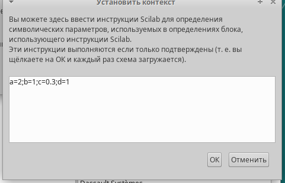{#fig:001 width=70%}

# Реализация модели в xcos

Для реализации модели будем использовать следующие блоки:

- CLOCK_c -- запуск часов модельного времени;
- CSCOPE -- регистрирующее устройство для построения графика;
- TEXT_f -- задаёт текст примечаний;
- MUX -- мультиплексер, позволяющий в данном случае вывести на графике сразу несколько кривых;
- INTEGRAL_m -- блок интегрирования;
- GAINBLK_f -- в данном случае позволяет задать значения коэффициентов β и ν;
- SUMMATION -- блок суммирования;
- PROD_f -- поэлементное произведение двух векторов на входе блока.
- CSCOPXY -- регистрирующее устройство для построения фазового портрета.

# Реализация модели в xcos

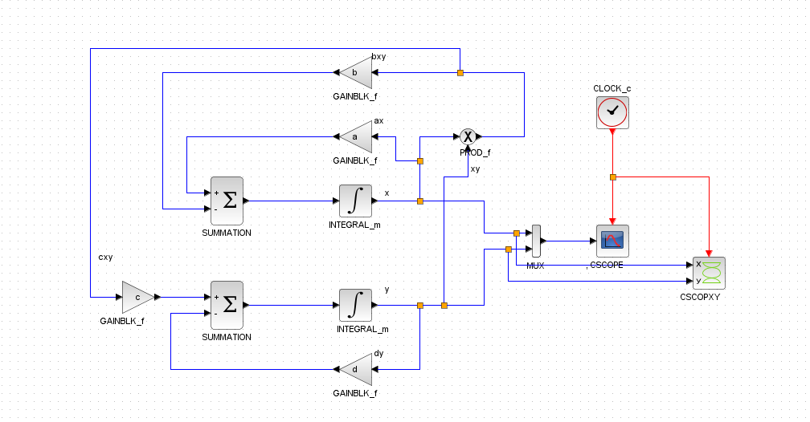{#fig:001 width=70%}

# Реализация модели в xcos

В параметрах блоков интегрирования необходимо задать начальные значения x(0)=2, y(0)=1

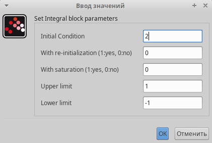{#fig:001 width=70%}

{#fig:001 width=70%}

# Реализация модели в xcos

В меню Моделирование, Установка зададим конечное время интегрирования, равным времени моделирования, в данном случае 30

{#fig:001 width=70%}

# Реализация модели в xcos

Результат моделирования представлен на рисунке Черной линией обозначен график x(t) (динамика численности жертв), зеленая линия определяет y(t)-- динамику численности хищников

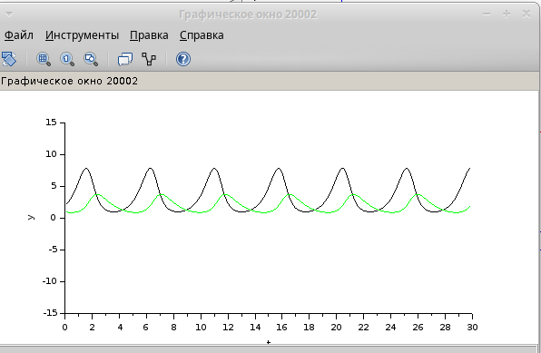{#fig:001 width=70%}

# Реализация модели в xcos

На следующем рисунке представлен фозовый портрет модели Лотки-Вольтерры.

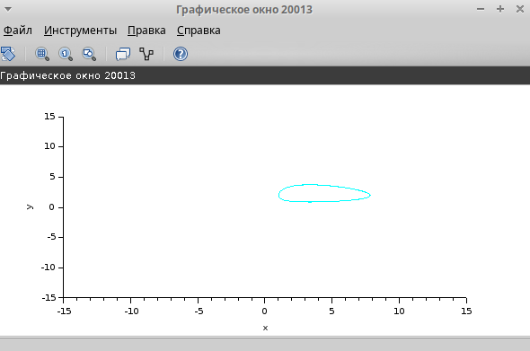{#fig:001 width=70%}

# Реализация модели с помощью блока Modelica в в xcos;

Для реализации модели с помощью языка Modelica потребуются следующие
блоки xcos: CLOCK_c, CSCOPE, CSCOPXY, TEXT_f, MUX, CONST_m и MBLOCK (Modelica
generic).

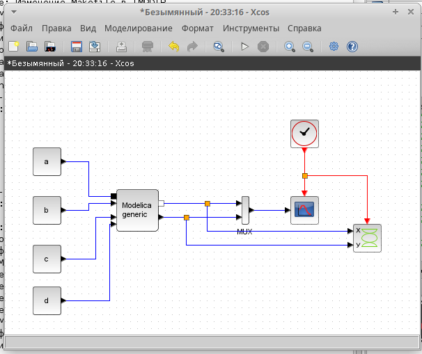{#fig:001 width=70%}

# Реализация модели с помощью блока Modelica в в xcos;

Как и ранее, задаём значения коэффициентов a, b, c, d

{#fig:001 width=70%}

# Реализация модели с помощью блока Modelica в в xcos;
Параметры блока Modelica:

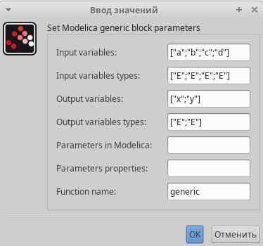{#fig:001 width=70%}

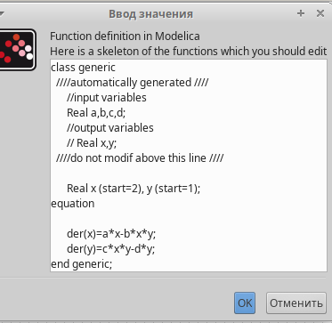{#fig:001 width=70%}

# Реализация модели с помощью блока Modelica в в xcos;
В результате моделирования получаем следующие графики.

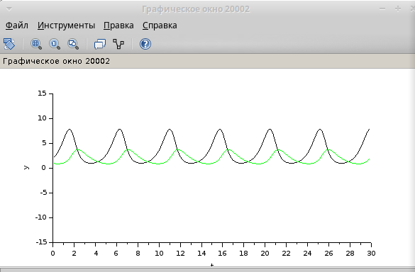{#fig:001 width=70%}

# Реализация модели с помощью блока Modelica в в xcos;

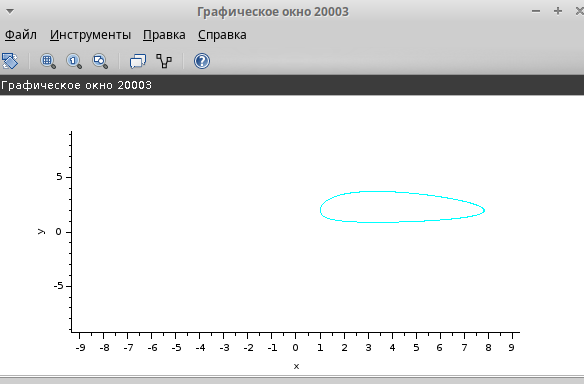{#fig:001 width=70%}

# Упражнение

В качестве упражнения нам надо построить модель «хищник – жертва» на OpenModelica. 

{#fig:001 width=70%}

# Упражнение

Задав конечное время 30 с, В результате получаем следующие графики:

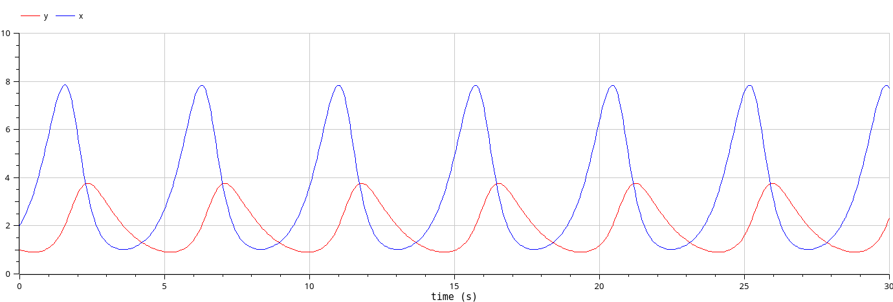{#fig:001 width=70%}

# Упражнение

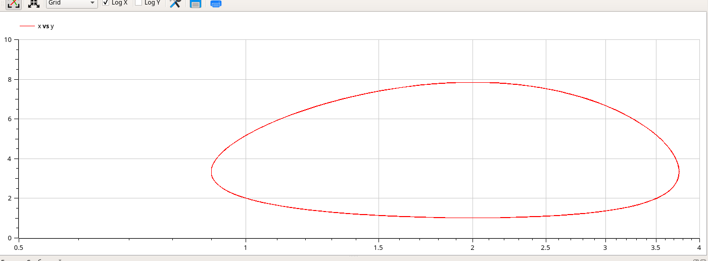{#fig:001 width=70%}

# Выводы

В процессе выполнения данной лабораторной работы была построена модель "хищник-жертва" в xcos и OpenModelica.