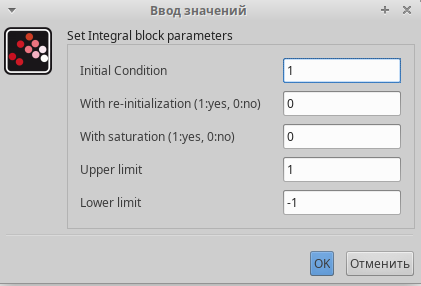
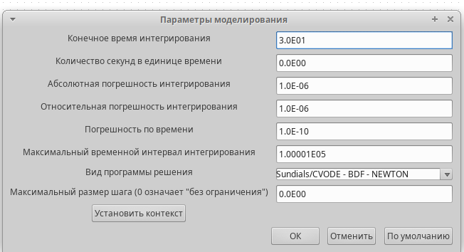
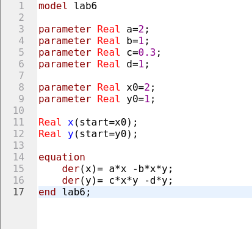

---
## Front matter
title: "Лабораторная работа №6"
subtitle: "Модель «хищник–жертва»"
author: "Эспиноса Василита Кристина Микаела"

## Generic otions
lang: ru-RU
toc-title: "Содержание"

## Bibliography
bibliography: bib/cite.bib
csl: pandoc/csl/gost-r-7-0-5-2008-numeric.csl

## Pdf output format
toc: true # Table of contents
toc-depth: 2
lof: true # List of figures
lot: true # List of tables
fontsize: 12pt
linestretch: 1.5
papersize: a4
documentclass: scrreprt
## I18n polyglossia
polyglossia-lang:
  name: russian
  options:
	- spelling=modern
	- babelshorthands=true
polyglossia-otherlangs:
  name: english
## I18n babel
babel-lang: russian
babel-otherlangs: english
## Fonts
mainfont: IBM Plex Serif
romanfont: IBM Plex Serif
sansfont: IBM Plex Sans
monofont: IBM Plex Mono
mathfont: STIX Two Math
mainfontoptions: Ligatures=Common,Ligatures=TeX,Scale=0.94
romanfontoptions: Ligatures=Common,Ligatures=TeX,Scale=0.94
sansfontoptions: Ligatures=Common,Ligatures=TeX,Scale=MatchLowercase,Scale=0.94
monofontoptions: Scale=MatchLowercase,Scale=0.94,FakeStretch=0.9
mathfontoptions:
## Biblatex
biblatex: true
biblio-style: "gost-numeric"
biblatexoptions:
  - parentracker=true
  - backend=biber
  - hyperref=auto
  - language=auto
  - autolang=other*
  - citestyle=gost-numeric
## Pandoc-crossref LaTeX customization
figureTitle: "Рис."
tableTitle: "Таблица"
listingTitle: "Листинг"
lofTitle: "Список иллюстраций"
lotTitle: "Список таблиц"
lolTitle: "Листинги"
## Misc options
indent: true
header-includes:
  - \usepackage{indentfirst}
  - \usepackage{float} # keep figures where there are in the text
  - \floatplacement{figure}{H} # keep figures where there are in the text
---

# Цель работы

Реализовать модель "хищник-жертва" в xcos

# Задание

- Реализовать модель "хищник-жертва" в xcos;
- Реализовать модель "хищник-жертва" с помощью блока Modelica в xcos;
- Реализовать модель "хищник-жертва" в OpenModelica

# Выполнение лабораторной работы
Модель «хищник–жертва» (модель Лотки — Вольтерры) представляет собой модель межвидовой конкуренции. В математической форме модель имеет вид:

$$
\begin{cases}
\dot{x} = a x - b x y \\
\dot{y} = c x y - d y
\end{cases}
$$

где x — количество жертв; y — количество хищников; a, b, c, d — коэффициенты, отражающие взаимодействия между видами: a — коэффициент рождаемости
жертв; b — коэффициент убыли жертв; c — коэффициент рождения хищников; d — коэффициент убыли хищников.

# Реализация модели в xcos

Зафиксируем начальные данные: a=2, b=1, c= 0,3, d=2, x(0)=2, y(0)=1.

В меню Моделирование, Задать переменные окружения зададим значения коэффициентов a,b,c,d

{#fig:001 width=70%}

Для реализации модели будем использовать следующие блоки:

- CLOCK_c -- запуск часов модельного времени;
- CSCOPE -- регистрирующее устройство для построения графика;
- TEXT_f -- задаёт текст примечаний;
- MUX -- мультиплексер, позволяющий в данном случае вывести на графике сразу несколько кривых;
- INTEGRAL_m -- блок интегрирования;
- GAINBLK_f -- в данном случае позволяет задать значения коэффициентов β и ν;
- SUMMATION -- блок суммирования;
- PROD_f -- поэлементное произведение двух векторов на входе блока.
- CSCOPXY -- регистрирующее устройство для построения фазового портрета.

{#fig:001 width=70%}

В параметрах блоков интегрирования необходимо задать начальные значения x(0)=2, y(0)=1

{#fig:001 width=70%}

{#fig:001 width=70%}

В меню Моделирование, Установка зададим конечное время интегрирования, равным времени моделирования, в данном случае 30

{#fig:001 width=70%}

Результат моделирования представлен на рисунке Черной линией обозначен график x(t) (динамика численности жертв), зеленая линия определяет y(t)-- динамику численности хищников

{#fig:001 width=70%}

На следующем рисунке представлен фозовый портрет модели Лотки-Вольтерры.

{#fig:001 width=70%}

# Реализация модели с помощью блока Modelica в в xcos;

Для реализации модели с помощью языка Modelica потребуются следующие
блоки xcos: CLOCK_c, CSCOPE, CSCOPXY, TEXT_f, MUX, CONST_m и MBLOCK (Modelica
generic).

{#fig:001 width=70%}

Как и ранее, задаём значения коэффициентов a, b, c, d

{#fig:001 width=70%}

Параметры блока Modelica:

{#fig:001 width=70%}

{#fig:001 width=70%}

В результате моделирования получаем следующие графики. Они идентичны построенным без блока Modelica.

{#fig:001 width=70%}

{#fig:001 width=70%}

# Упражнение

- Реализуйте модель «хищник – жертва» в OpenModelica. Постройте
графики изменения численности популяций и фазовый портрет.

{#fig:001 width=70%}

Задав конечное время 30 с, В результате получаем следующие графики:

{#fig:001 width=70%}

{#fig:001 width=70%}

# Выводы

В процессе выполнения данной лабораторной работы была построена модель "хищник-жертва" в xcos и OpenModelica.

# Список литературы{.unnumbered}

::: {#refs}
:::
