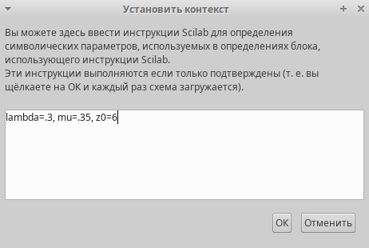
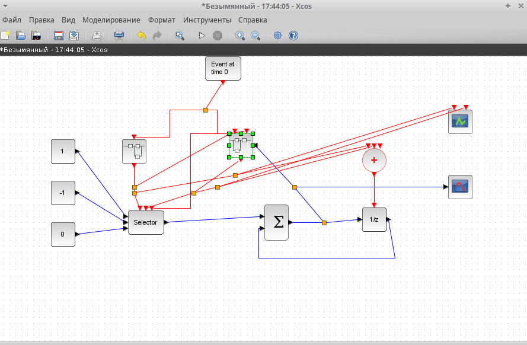
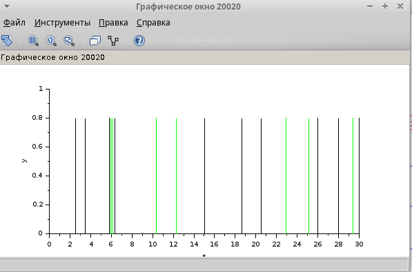

---
## Front matter
lang: ru-RU
title: "Лабораторная работа №7"
subtitle: Модель M|M|1|∞ 
author:
  - Эспиноса Василита К.М.
institute:
  - Российский университет дружбы народов, Москва, Россия

date: 22/03/2025

## i18n babel
babel-lang: russian
babel-otherlangs: english

## Formatting pdf
toc: false
toc-title: Содержание
slide_level: 2
aspectratio: 169
section-titles: true
theme: metropolis
header-includes:
 - \metroset{progressbar=frametitle,sectionpage=progressbar,numbering=fraction}
---

# Информация

## Докладчик

:::::::::::::: {.columns align=center}
::: {.column width="70%"}

  * Эспиноса Василита Кристина Микаела
  * студентка
  * Российский университет дружбы народов
  * [1032224624@pfur.ru](mailto:1032224624@pfur.ru)
  * <https://github.com/crisespinosa/>

:::
::: {.column width="30%"}

:::
::::::::::::::

# Цель работы

Рассмотреть пример моделирования в xcos системы массового обслуживания типа Модель M|M|1|∞ 

# Задание

- Реализовать модель системы массового обслуживания типа  M|M|1|∞ ;
- Построить график поступления и обработки заявок;
- Построить график динамики размера очереди.

# Выполнение лабораторной работы

Зафиксируем начальные данные: λ = 0.3, μ = 0.35, z0=.  В меню Моделирование, Установить контекст зададим значения коэффициентов

{#fig:001 width=70%}

# Реализация модели в xcos

Суперблок, моделирующий поступление заявок, представлен на рис. [-@fig:002]. Тут у нас заявки поступают в систему по пуассоновскому закону. Поступает заявка в суперблок, идет в синхронизатор входных и выходных сигналов, происходит равномерное распределение на интервале 
[0;1] (также заявка идет в обработчик событий), далее идет преобразование в экспоненциальное распределение с параметром λ, далее заявка опять попадает в обработчик событий и выходит из суперблока.

{#fig:002 width=70%}

# Реализация модели в xcos

Суперблок, моделирующий процесс обработки заявок, представлен на рис. [-@fig:003]. Тут происходит обработка заявок в очереди по экспоненциальному закону.

{#fig:003 width=70%}

# Реализация модели в xcos

Готовая модель представлена на рис. [-@fig:004]. 
Тут есть селектор, два суперблока, построенных ранее, первоначальное событие на вход в суперблок, суммирование, оператор задержки (имитация очереди), также есть регистрирующие блоки: регистратор размера очереди и регистратор событий.

{#fig:004 width=70%}

# Результат моделирования

{#fig:005 width=70%}

# Результат моделирования

{#fig:006 width=70%}

# Выводы

В процессе выполнения данной лабораторной работы я рассмотрела пример моделирования в xcos системы массового обслуживания типа M|M|1|∞