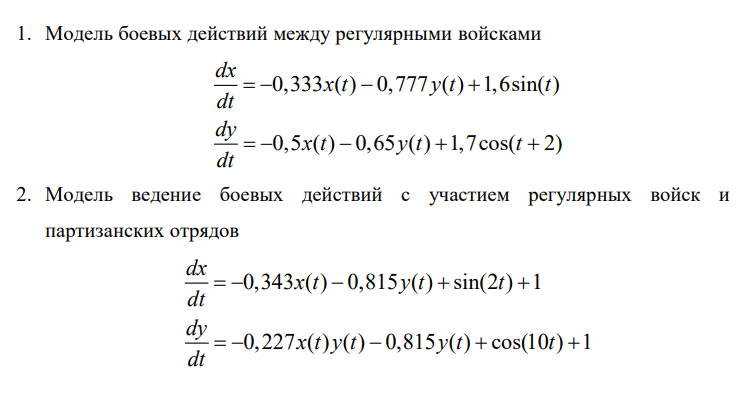
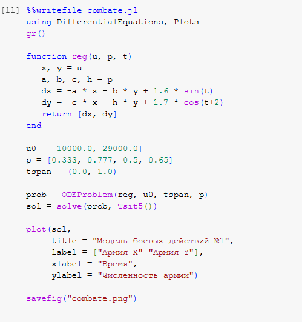
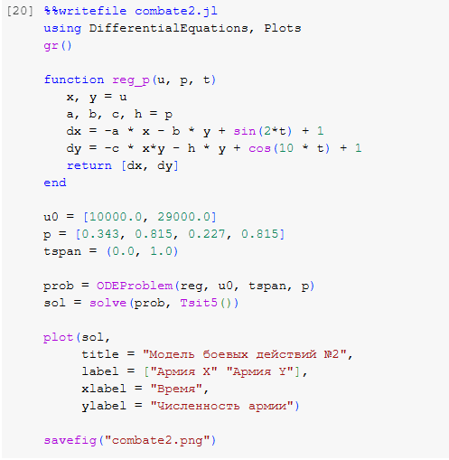

---
## Front matter
title: "Лабораторная работа №3"
subtitle: "Модель боевых действий"
author: "Эспиноса Василита Кристина Микаела"

## Generic otions
lang: ru-RU
toc-title: "Содержание"

## Bibliography
bibliography: bib/cite.bib
csl: pandoc/csl/gost-r-7-0-5-2008-numeric.csl

## Pdf output format
toc: true # Table of contents
toc-depth: 2
lof: true # List of figures
lot: true # List of tables
fontsize: 12pt
linestretch: 1.5
papersize: a4
documentclass: scrreprt
## I18n polyglossia
polyglossia-lang:
  name: russian
  options:
	- spelling=modern
	- babelshorthands=true
polyglossia-otherlangs:
  name: english
## I18n babel
babel-lang: russian
babel-otherlangs: english
## Fonts
mainfont: IBM Plex Serif
romanfont: IBM Plex Serif
sansfont: IBM Plex Sans
monofont: IBM Plex Mono
mathfont: STIX Two Math
mainfontoptions: Ligatures=Common,Ligatures=TeX,Scale=0.94
romanfontoptions: Ligatures=Common,Ligatures=TeX,Scale=0.94
sansfontoptions: Ligatures=Common,Ligatures=TeX,Scale=MatchLowercase,Scale=0.94
monofontoptions: Scale=MatchLowercase,Scale=0.94,FakeStretch=0.9
mathfontoptions:
## Biblatex
biblatex: true
biblio-style: "gost-numeric"
biblatexoptions:
  - parentracker=true
  - backend=biber
  - hyperref=auto
  - language=auto
  - autolang=other*
  - citestyle=gost-numeric
## Pandoc-crossref LaTeX customization
figureTitle: "Рис."
tableTitle: "Таблица"
listingTitle: "Листинг"
lofTitle: "Список иллюстраций"
lotTitle: "Список таблиц"
lolTitle: "Листинги"
## Misc options
indent: true
header-includes:
  - \usepackage{indentfirst}
  - \usepackage{float} # keep figures where there are in the text
  - \floatplacement{figure}{H} # keep figures where there are in the text
---

# Цель работы

Построить модель боевых действий на языке прогаммирования Julia и посредством ПО OpenModelica.

# Задание

Между страной Х и страной У идет война. Численность состава войск
исчисляется от начала войны, и являются временными функциями x(t) и y(t). В
начальный момент времени страна Х имеет армию численностью 10 000 человек, а
в распоряжении страны У армия численностью в 29 000 человек. Для упрощения
модели считаем, что коэффициенты
a,b,c,h постоянны. Также считаем P(t) и Q(t) непрерывные функции.
Постройте графики изменения численности войск армии Х и армии У для
следующих случаев:

{#fig:001 width=70%}

# Теоретическое введение

Законы Ланчестера (законы Осипова — Ланчестера) — математическая формула для расчета относительных сил пары сражающихся сторон — подразделений вооруженных сил. В статье «Влияние численности сражающихся сторон на их потери», опубликованной журналом «Военный сборник» в 1915 году, генерал-майор Корпуса военных топографов М. П. 
Осипов описал математическую модель глобального вооружённого противостояния, практически применяемую в военном деле при описании убыли сражающихся сторон с течением времени и, входящую в математическую теорию исследования операций, на год опередив английского математика Ф. У. Ланчестера. Мировая война, две революции в России не позволили новой власти заявить в установленном в научной среде порядке об открытии царского офицера.

Уравнения Ланчестера — это дифференциальные уравнения, описывающие зависимость между силами сражающихся сторон A и D как функцию от времени, причем функция зависит только от A и D.

В 1916 году, в разгар первой мировой войны, Фредерик Ланчестер разработал систему дифференциальных уравнений для демонстрации соотношения между противостоящими силами.
Среди них есть так называемые Линейные законы Ланчестера (первого рода или честного боя, для рукопашного боя или неприцельного огня) и Квадратичные законы Ланчестера (для войн начиная с XX века с применением прицельного огня, дальнобойных орудий, огнестрельного оружия). В связи с установленным приоритетом в англоязычной литературе наметилась тенденция перехода от фразы «модель Ланчестера» к «модели Осипова — Ланчестера» [@wiki:bash].

# Выполнение лабораторной работы 

## Модель боевых действий между регулярными войсками

### Модель боевых действий №1

В данной **модели боевых действий №1** рассматривается взаимодействие двух армий X и Y в течение одного дня. Потери армий описываются системой дифференциальных уравнений, где:

- члены `−0.333 x(t)` и `−0.65 y(t)` отражают **небоевые потери**, связанные с внешними факторами: болезнями, логистическими проблемами, моральным состоянием и т.д.;
- члены `−0.777 y(t)` и `−0.5 x(t)` моделируют **боевые потери**, зависящие от численности противника и эффективности наступательных действий;
- добавочные функции `1.6 sin(t)` и `1.7 cos(t + 2)` учитывают возможные **внешние воздействия**, такие как подкрепления, изменение погодных условий или морального духа армий X и Y соответственно.

{#fig:001 width=70%}

На основании численного решения видно, что:

- **Армия X** (синяя линия) стремительно теряет численность — с 10 000 в начале до почти **нуля** к концу дня. Это указывает на высокую уязвимость армии X к боевым и небоевым потерям.
- **Армия Y** (оранжевая линия), несмотря на потери, сохраняет численность выше 20 000, начиная с 29 000. Это демонстрирует **большую устойчивость** армии Y.

{#fig:002 width=70%}

Теперь давайте построим эту же модель посредством OpenModelica.

{#fig:003 width=70%}

В результате получаем слудющий график изменения численности армий

{#fig:004 width=70%}

## Модель ведение боевых действий с участием регулярных войск и партизанских отрядов

### Модель боевых действий №2

В модели наша система дифференциальных уравнений включает:

- члены `−0.343 x(t)` и `−0.815 y(t)` — это **небоевые потери**, связанные с логистикой, болезнями и другими факторами;
- член `−0.227 x(t) * y(t)` во втором уравнении — это **нелинейный боевой вклад**, моделирующий интенсивное взаимодействие между армиями, особенно при больших значениях \( x \) и \( y \);
- слагаемые `sin(2t) + 1` и `cos(10t) + 1` представляют **внешние влияния и подкрепления**, воздействующие на армии с различной частотой.

{#fig:005 width=70%}

На основании численного решения видно, что:

- **Армия X** (синяя линия) начинает с 10 000 солдат и **медленно теряет численность**, заканчивая примерно на уровне 8 500–9 000. Это говорит о контролируемом уровне потерь и устойчивости.
- **Армия Y** (оранжевая линия), несмотря на начальную численность в 29 000, практически **мгновенно теряет всю боеспособность**. Численность падает до нуля в течение первых мгновений симуляции.

{#fig:006 width=70%}

Теперь давайте построим эту же модель посредством OpenModelica.

{#fig:007 width=70%}

В результате получаем слудющий график изменения численности армий

{#fig:008 width=70%}

# Результат моделирования

{#fig:005 width=70%}

{#fig:006 width=70%}

# Выводы

В процессе выполнения данной лабораторной работы я построила модель боевых действий на языке прогаммирования Julia и посредством ПО OpenModelica, а также провела сравнительный анализ.

# Список литературы{.unnumbered}

::: {#refs}
:::
