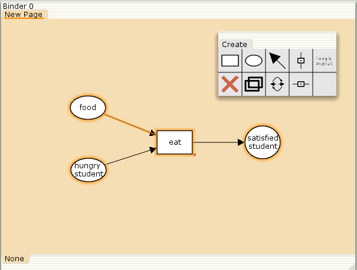
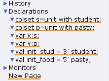
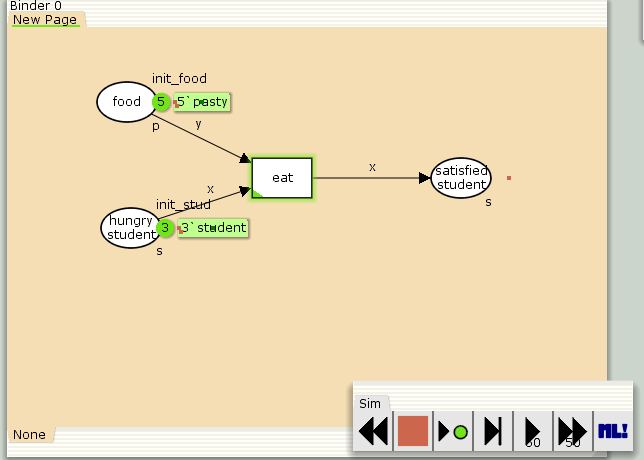
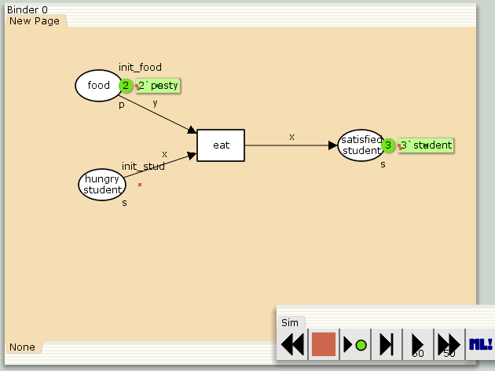
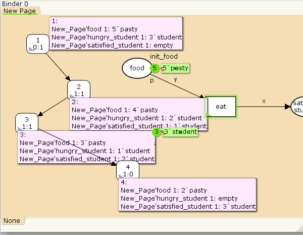

---
## Front matter
lang: ru-RU
title: "Лабораторная работа №9"
subtitle: Модель «Накорми студентов» 
author:
  - Эспиноса Василита К.М.
institute:
  - Российский университет дружбы народов, Москва, Россия

date: 26/03/2025

## i18n babel
babel-lang: russian
babel-otherlangs: english

## Formatting pdf
toc: false
toc-title: Содержание
slide_level: 2
aspectratio: 169
section-titles: true
theme: metropolis
header-includes:
 - \metroset{progressbar=frametitle,sectionpage=progressbar,numbering=fraction}
---

# Информация

## Докладчик

:::::::::::::: {.columns align=center}
::: {.column width="70%"}

  * Эспиноса Василита Кристина Микаела
  * студентка
  * Российский университет дружбы народов
  * [1032224624@pfur.ru](mailto:1032224624@pfur.ru)
  * <https://github.com/crisespinosa/>

:::
::: {.column width="30%"}


:::
::::::::::::::


# Цель работы

Реализовать модель "Накорми студентов" в CPN Tools.

# Задание

- Реализовать модель "Накорми студентов" в CPN Tools;

- Вычислить пространство состояний, сформировать отчет о нем и построить граф.


# Выполнение лабораторной работы

Рассмотрим пример студентов, обедающих пирогами. Голодный студент становится сытым после того, как съедает пирог.

Таким образом, имеем:

* два типа фишек: «пироги» и «студенты»;
* три позиции: «голодный студент», «пирожки», «сытый студент»;
* один переход: «съесть пирожок».

# Выполнение лабораторной работы

Сначала нарисуем граф сети. Для этого с помощью контекстного меню создаём новую сеть, добавляем позиции, переход и дуги (рис. [-@fig:001]).

{#fig:001 width=70%}

# Выполнение лабораторной работы

В меню задаём новые декларации модели: типы фишек, начальные значения позиций, выражения для дуг. Для этого наведя мышку на меню Standart declarations, правой кнопкой вызываем контекстное меню и выбираем New Decl (рис. [-@fig:002]).

{#fig:002 width=70%}

# Выполнение лабораторной работы

После этого задаем тип s фишкам, относящимся к студентам, тип p — фишкам, относящимся к пирогам, задаём значения переменных x и y для дуг и начальные значения мультимножеств init_stud и init_food. 
В результате получаем работающую модель (рис. [-@fig:003]).

{#fig:003 width=70%}

# Выполнение лабораторной работы

После запуска фишки типа «пирожки» из позиции «еда» и фишки типа «студенты» из позиции «голодный студент», пройдя через переход «кушать», попадают в позицию «сытый студент» и преобразуются в тип «студенты» (рис. [-@fig:004]).

{#fig:004 width=70%}

# Упражнение

ычислим пространство состояний. Прежде, чем пространство состояний может быть вычислено и проанализировано, необходимо сформировать код пространства состояний. Этот код создается, когда используется инструмент Войти в пространство состояний. 
Вход в пространство состояний занимает некоторое время. Затем, если ожидается, что пространство состояний будет небольшим, можно просто применить инструмент Вычислить пространство состояний к листу, содержащему страницу сети. 
Сформируем отчёт о пространстве состояний и проанализируем его. Чтобы сохранить отчет, необходимо применить инструмент Сохранить отчет о пространстве состояний к листу, содержащему страницу сети и ввести имя файла отчета.
Из полученного отчета можно узнать:

# Упражнение

- В графе есть 4 узла и 3 дуги (4 состояния и 3 перехода).
- Указаны границы значений для каждого элемента: голодные студенты (максимум - 3, минимум - 0), сытые студенты (максимум - 3, минимум - 0), еда (максимум - 5, минимум - 2, минимальное значение 2, так как в конце симуляции остаются пирожки).
- Также указаны границы мультимножеств.
- Маркировка home равная 4.
- Маркировка dead равная 4.
- В конце указано, что нет бесконечных последовательностей вхождений.

# Упражнение

```
CPN Tools state space report for:
<unsaved net>
Report generated: Sat Apr 26 16:17:23 2025


 Statistics
------------------------------------------------------------------------

  State Space
     Nodes:  4
     Arcs:   3
     Secs:   0
     Status: Full

  Scc Graph
     Nodes:  4
     Arcs:   3
     Secs:   0


Boundedness Properties
------------------------------------------------------------------------

  Best Integer Bounds
                             Upper      Lower
     New_Page'food 1         5          2
     New_Page'hungry_student 1
                             3          0
     New_Page'satisfied_student 1
                             3          0
```

# Упражнение

Построим граф пространства состояний:

{#fig:005 width=70%}

# Выводы

В процессе выполнения данной лабораторной работы я реализовала модель "Накорми студентов" в CPN Tools.

