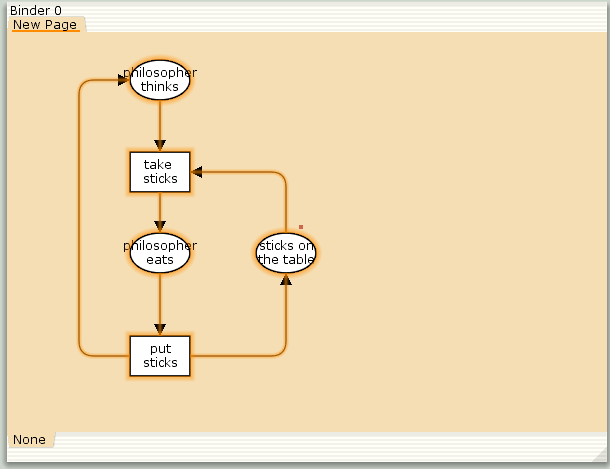
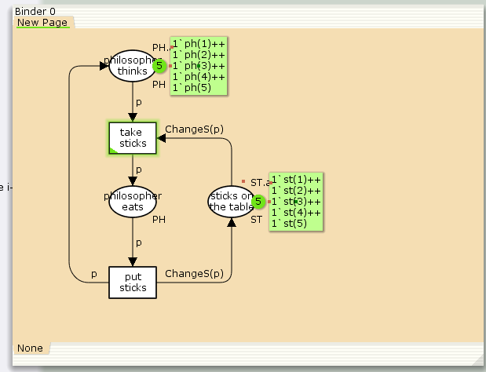
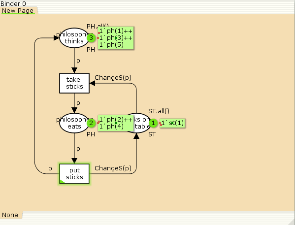

---
## Front matter
lang: ru-RU
title: "Лабораторная работа №10"
subtitle: Задача об обедающих мудрецах
author:
  - Эспиноса Василита К.М.
institute:
  - Российский университет дружбы народов, Москва, Россия

date: 26/03/2025

## i18n babel
babel-lang: russian
babel-otherlangs: english

## Formatting pdf
toc: false
toc-title: Содержание
slide_level: 2
aspectratio: 169
section-titles: true
theme: metropolis
header-includes:
 - \metroset{progressbar=frametitle,sectionpage=progressbar,numbering=fraction}
---

# Информация

## Докладчик

:::::::::::::: {.columns align=center}
::: {.column width="70%"}

  * Эспиноса Василита Кристина Микаела
  * студентка
  * Российский университет дружбы народов
  * [1032224624@pfur.ru](mailto:1032224624@pfur.ru)
  * <https://github.com/crisespinosa/>

:::
::: {.column width="30%"}


:::
::::::::::::::

# Цель работы

Реализовать модель задачи об обедающих мудрецах в CPN Tools.

# Задание

- Реализовать модель задачи об обедающих мудрецах в CPN Tools;
- Вычислить пространство состояний, сформировать отчет о нем и построить граф.


# Выполнение лабораторной работы

Постановка задачи

Пять мудрецов сидят за круглым столом и могут пребывать в двух состояниях -- думать и есть. Между соседями лежит одна палочка для еды. Для приёма пищи необходимы две палочки. 
Палочки -- пересекающийся ресурс. Необходимо синхронизировать процесс еды так, чтобы мудрецы не умерли с голода.

Рисуем граф сети. Для этого с помощью контекстного меню создаём новую сеть, добавляем позиции, переходы и дуги (рис. [-@fig:001]).
Начальные данные:

позиции: мудрец размышляет (philosopher thinks), мудрец ест (philosopher eats), палочки находятся на столе (sticks on the table)
переходы: взять палочки (take sticks), положить палочки (put sticks)

# Выполнение лабораторной работы

{#fig:001 width=70%}

# Выполнение лабораторной работы

В меню задаём новые декларации модели (рис. [-@fig:002]): типы фишек, начальные значения позиций, выражения для дуг:

n — число мудрецов и палочек 
p — фишки, обозначающие мудрецов, имеют перечисляемый тип PH от 1 до 
s — фишки, обозначающие палочки, имеют перечисляемый тип ST от 1 до 
функция ChangeS(p) ставит в соответствие мудрецам палочки (возвращает номера палочек, используемых мудрецами); по условию задачи мудрецы сидят по кругу и мудрец p(i) может взять i и i+1 палочки, поэтому функция ChangeS(p) определяется следующим образом:

```
fun ChangeS (ph(i))=
1`st(i)++st(if = n then 1 else i+1)
```
# Выполнение лабораторной работы

{#fig:002 width=70%}

# Выполнение лабораторной работы

В результате получаем работающую модель (рис. [-@fig:003]).

{#fig:003 width=70%}

# Выполнение лабораторной работы

После запуска модели наблюдаем, что одновременно палочками могут воспользоваться только два из пяти мудрецов (рис. [-@fig:004]).

{#fig:004 width=70%}

# Выполнение лабораторной работы

Вычислим пространство состояний. Прежде, чем пространство состояний может быть вычислено и проанализировано, необходимо сформировать код пространства состояний. Этот код создается, когда используется инструмент Войти в пространство состояний. Вход в пространство состояний занимает некоторое время. Затем, если ожидается, что пространство состояний будет небольшим, можно просто применить инструмент Вычислить пространство состояний к листу, содержащему страницу сети. Сформируем отчёт о пространстве состояний и проанализируем его. Чтобы сохранить отчет, необходимо применить инструмент Сохранить отчет о пространстве состояний к листу, содержащему страницу сети и ввести имя файла отчета.

Из отчета можем узнать, что:

    есть 11 состояний и 30 переходов между ними;
    указаны границы значений для каждого элемента: думающие мудрецы (максимум - 5, минимум - 3), мудрецы едят (максимум - 2, минимум - 0), палочки на столе (максимум - 5, минимум - 1, минимальное значение 2, так как в конце симуляции остаются пирожки);
    указаны границы в виде мультимножеств;
    маркировка home для всех состояний;
    маркировка dead равна None;
    указано, что бесконечно часто происходят события положить и взять палочку.

# Выполнение лабораторной работы

```

CPN Tools state space report for:
/var/tmp/petri.cpn
Report generated: Sat Apr 26 17:03:47 2025


 Statistics
------------------------------------------------------------------------

  State Space
     Nodes:  11
     Arcs:   30
     Secs:   0
     Status: Full

  Scc Graph
     Nodes:  1
     Arcs:   0
     Secs:   0


 Boundedness Properties
------------------------------------------------------------------------

  Best Integer Bounds
                             Upper      Lower
     New_Page'philosopher_eats 1
                             2          0
     New_Page'philosopher_thinks 1
                             5          3
     New_Page'sticks_on_the_table 1
                             5          1

 
```

# Выполнение лабораторной работы

Построим граф пространства состояний (рис. [-@fig:005]).

{#fig:005 width=70%}

# Выводы

В процессе выполнения данной лабораторной работы я реализовала модель задачи об обедающих мудрецах в CPN Tools.
