---
## Front matter
lang: ru-RU
title: "Лабораторная работа №11"
subtitle: Модель системы массового обслуживания $M|M|1$
author:
  - Эспиноса Василита К.М.
institute:
  - Российский университет дружбы народов, Москва, Россия

date: 26/04/2025

## i18n babel
babel-lang: russian
babel-otherlangs: english

## Formatting pdf
toc: false
toc-title: Содержание
slide_level: 2
aspectratio: 169
section-titles: true
theme: metropolis
header-includes:
 - \metroset{progressbar=frametitle,sectionpage=progressbar,numbering=fraction}
---

# Информация

## Докладчик

:::::::::::::: {.columns align=center}
::: {.column width="70%"}

  * Эспиноса Василита Кристина Микаела
  * студентка
  * Российский университет дружбы народов
  * [1032224624@pfur.ru](mailto:1032224624@pfur.ru)
  * <https://github.com/crisespinosa/>

:::
::: {.column width="30%"}


:::
::::::::::::::

# Цель работы

Реализовать модель $M|M|1$ в CPN tools

# Задание

- Реализовать в CPN Tools модель системы массового обслуживания M|M|1.
- Настроить мониторинг параметров моделируемой системы и нарисовать графики очереди.


# Выполнение лабораторной работы

В систему поступает поток заявок двух типов, распределённый по пуассоновскому закону. Заявки поступают в очередь сервера на обработку. Дисциплина очереди - FIFO. Если сервер находится в режиме ожидания (нет заявок на сервере), то заявка поступает на обработку сервером.

Будем использовать три отдельных листа: на первом листе опишем граф системы (рис. [-@fig:001]), на втором — генератор заявок (рис. [-@fig:002]), на третьем — сервер обработки заявок (рис. [-@fig:003]).

Сеть имеет 2 позиции (очередь — Queue, обслуженные заявки — Complited) и два перехода (генерировать заявку — Arrivals, передать заявку на обработку сер- веру — Server). Переходы имеют сложную иерархическую структуру, задаваемую на отдельных листах модели (с помощью соответствующего инструмента меню — Hierarchy).

# Выполнение лабораторной работы

Между переходом Arrivals и позицией Queue, а также между позицией Queue и переходом Server установлена дуплексная связь. Между переходом Server и позицией Complited — односторонняя связь.

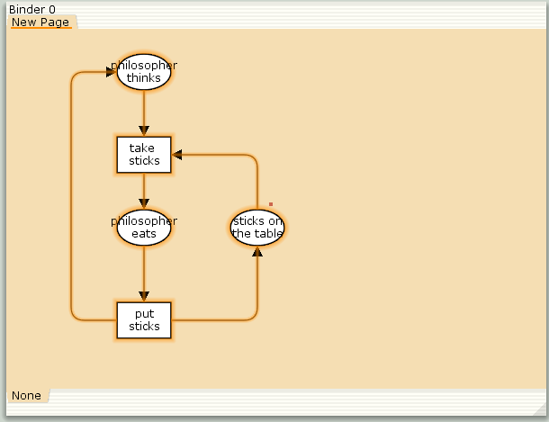{#fig:001 width=70%}

# Выполнение лабораторной работы

Граф генератора заявок имеет 3 позиции (текущая заявка — Init, следующая заявка — Next, очередь — Queue из листа System) и 2 перехода (Init — определяет распределение поступления заявок по экспоненциальному закону с интенсивностью 100 заявок в единицу времени, Arrive — определяет поступление заявок в очередь).

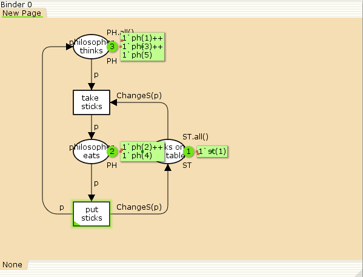{#fig:002 width=70%}

# Выполнение лабораторной работы

Граф процесса обработки заявок на сервере имеет 4 позиции (Busy — сервер занят, Idle — сервер в режиме ожидания, Queue и Complited из листа System) и 2 перехода (Start — начать обработку заявки, Stop — закончить обработку заявки).

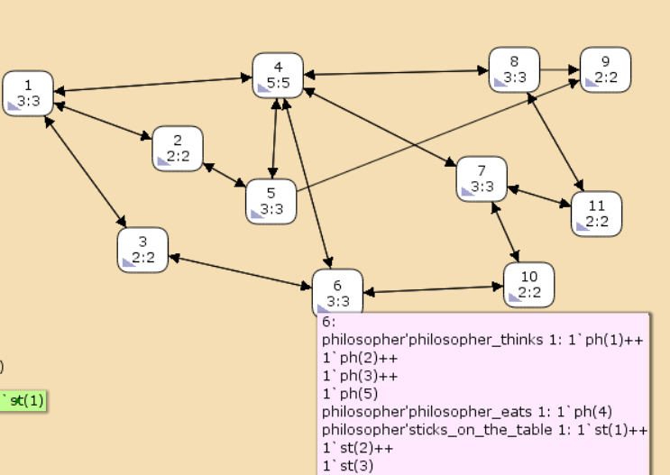{#fig:003 width=70%}

# Выполнение лабораторной работы

Зададим декларации системы (рис. [-@fig:004]).

Определим множества цветов системы (colorset):

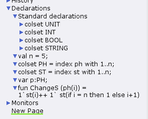{#fig:004 width=70%}

# Выполнение лабораторной работы

Зададим параметры модели на графах сети.

На листе System (рис. [-@fig:005]):

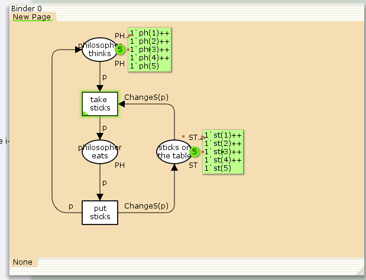{#fig:005 width=70%}

# Выполнение лабораторной работы

На листе Arrivals (рис. [-@fig:006]):


{#fig:006 width=70%}

# Выполнение лабораторной работы

На листе Server (рис. [-@fig:007]):

{#fig:007 width=70%}

# Мониторинг параметров моделируемой системы

Потребуется палитра Monitoring. Выбираем Break Point (точка останова) и устанавливаем её на переход Start. После этого в разделе меню Monitor появится новый подраздел, который назовём Ostanovka. В этом подразделе необходимо внести изменения в функцию Predicate, которая будет выполняться при запуске монитора. Зададим число шагов, через которое будем останавливать мониторинг. Для этого true заменим на Queue_Delay.count()=200.

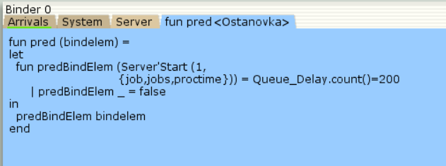{#fig:008 width=70%}

# Мониторинг параметров моделируемой системы

Необходимо определить конструкцию Queue_Delay.count(). С помощью палитры Monitoring выбираем Data Call и устанавливаем на переходе Start. Появившийся в меню монитор называем Queue Delay (без подчеркивания). Функция Observer выполняется тогда, когда функция предикатора выдаёт значение true. По умолчанию функция выдаёт 0 или унарный минус (~1), подчёркивание обозначает произвольный аргумент. Изменим её так, чтобы получить значение задержки в очереди. Для этого необходимо из текущего времени intTime() вычесть временную метку AT , означающую приход заявки в очередь.

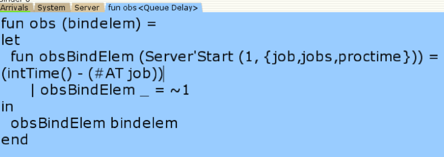{#fig:009 width=70%}

# Мониторинг параметров моделируемой системы

После запуска программы на выполнение в каталоге с кодом программы появится файл Queue_Delay.log (рис. [-@fig:010]), содержащий в первой колонке — значение задержки очереди, во второй — счётчик, в третьей — шаг, в четвёртой — время.

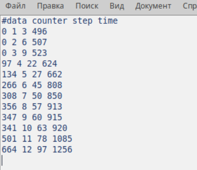{#fig:010 width=70%}

# Мониторинг параметров моделируемой системы

С помощью gnuplot можно построить график значений задержки в очереди (рис. [-@fig:011]), выбрав по оси x время, а по оси y — значения задержки:

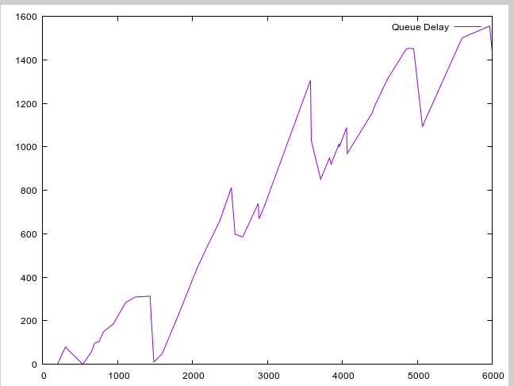{#fig:011 width=70%}

# Мониторинг параметров моделируемой системы

Посчитаем задержку в действительных значениях. С помощью палитры Monitoring выбираем Data Call и устанавливаем на переходе Start. Появившийся в меню монитор называем Queue Delay Real. Функцию Observer изменим следующим образом(рис. [-@fig:012]):

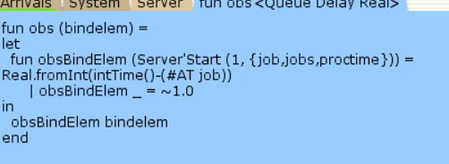{#fig:012 width=70%}

# Мониторинг параметров моделируемой системы

По сравнению с предыдущим описанием функции добавлено преобразование значения функции из целого в действительное, при этом obsBindElem _ принимает значение ~1.0. После запуска программы на выполнение в каталоге с кодом программы появится файл Queue_Delay_Real.log с содержимым, аналогичным содержимому файла Queue_Delay.log, но значения задержки имеют действительный тип (рис. [-@fig:013]):


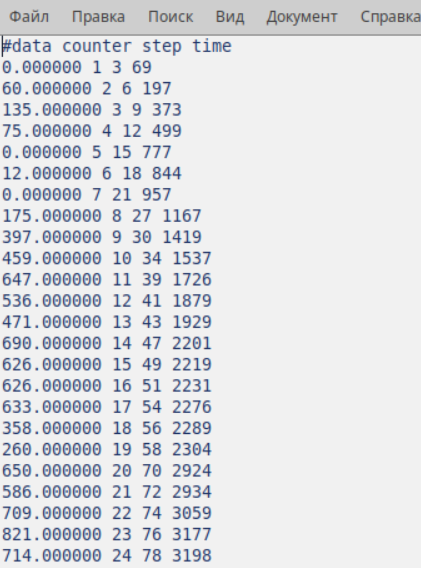{#fig:013 width=70%}

# Мониторинг параметров моделируемой системы

Посчитаем, сколько раз задержка превысила заданное значение. С помощью палитры Monitoring выбираем Data Call и устанавливаем на переходе Start. Монитор называем Long Delay Time. Функцию Observer изменим следующим образом (рис. [-@fig:014]):

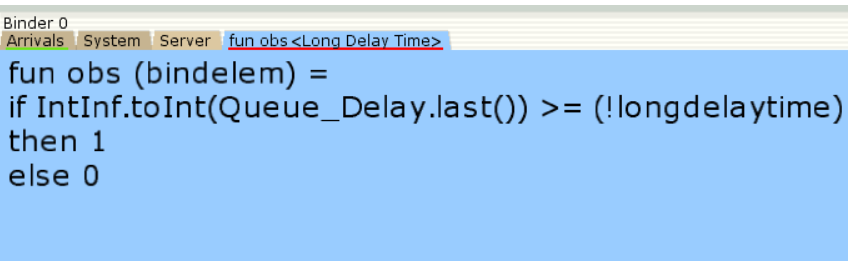{#fig:014 width=70%}

# Мониторинг параметров моделируемой системы

При этом необходимо в декларациях задать глобальную переменную (в форме ссылки на число 200): longdelaytime

```
globref longdaytime = 200

```

После запуска программы на выполнение в каталоге с кодом программы появится файл Long_Delay_Time.log (рис. [-@fig:015])

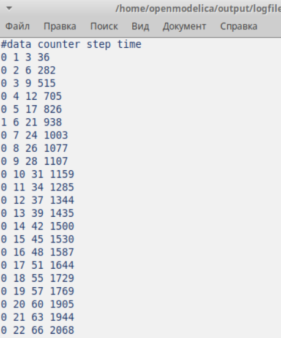{#fig:015 width=70%}

# Мониторинг параметров моделируемой системы

С помощью gnuplot можно построить график (рис. [-@fig:016]), демонстрирующий, в какие периоды времени значения задержки в очереди превышали заданное значение 200.

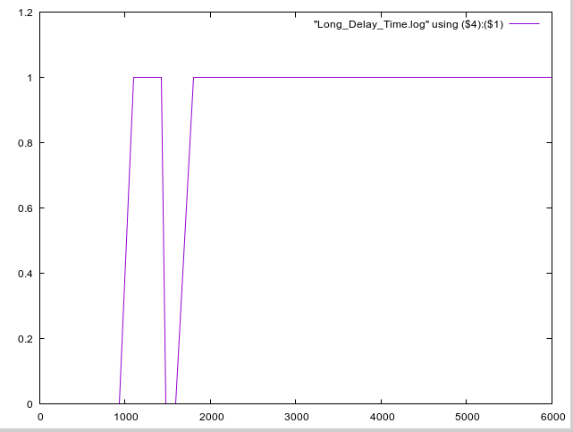{#fig:016 width=70%}

# Выводы

В процессе выполнения данной лабораторной работы я реализовала модель системы массового обслуживания  M|M|1 в CPN Tools.

:::
