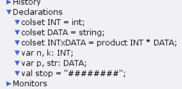
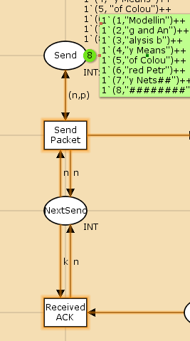
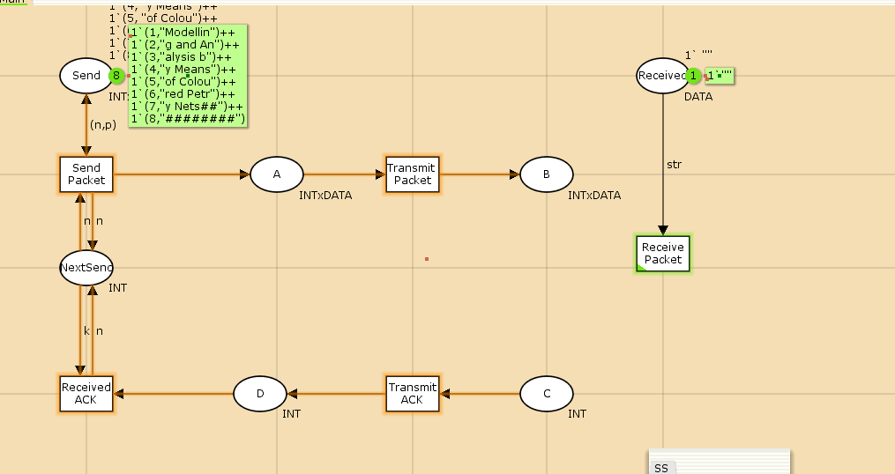
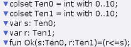
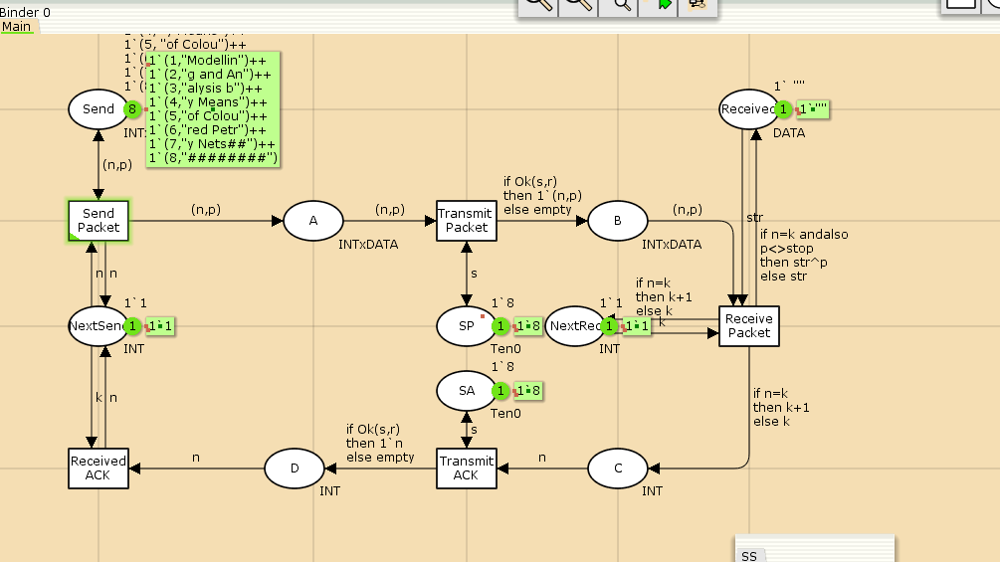
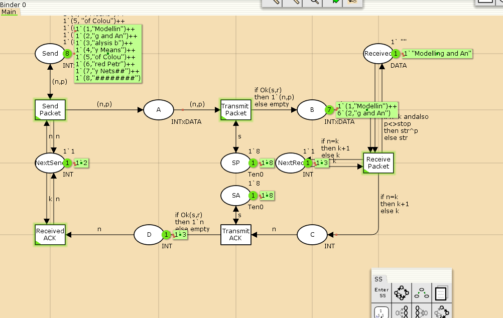
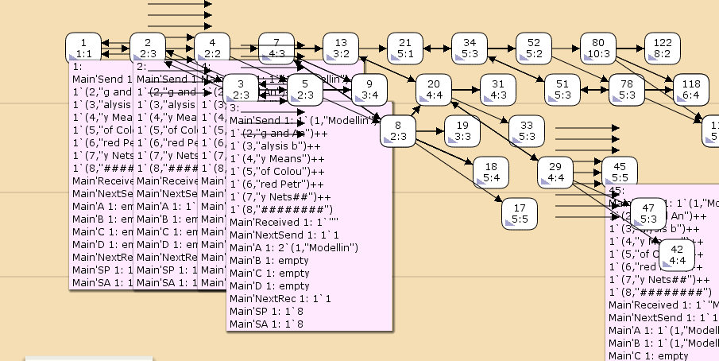

---
## Front matter
lang: ru-RU
title: "Лабораторная работа №8"
subtitle: "Пример моделирования простого протокола передачи данных"
author:
  - Эспиноса Василита К.М.
institute:
  - Российский университет дружбы народов, Москва, Россия

date: 26/04/2025

## i18n babel
babel-lang: russian
babel-otherlangs: english

## Formatting pdf
toc: false
toc-title: Содержание
slide_level: 2
aspectratio: 169
section-titles: true
theme: metropolis
header-includes:
 - \metroset{progressbar=frametitle,sectionpage=progressbar,numbering=fraction}
---

# Информация

## Докладчик

:::::::::::::: {.columns align=center}
::: {.column width="70%"}

  * Эспиноса Василита Кристина Микаела
  * студентка
  * Российский университет дружбы народов
  * [1032224624@pfur.ru](mailto:1032224624@pfur.ru)
  * <https://github.com/crisespinosa/>

:::
::: {.column width="30%"}


:::
::::::::::::::

# Цель работы

Реализовать простой протокол передачи данных в CPN Tools.

# Задание

- Реализовать простой протокол передачи данных в CPN Tools.
- Вычислить пространство состояний, сформировать отчет о нем и построить граф.


# Выполнение лабораторной работы

Основные состояния: источник (Send), получатель (Receiver). Действия (переходы): отправить пакет (Send Packet), отправить подтверждение (Send ACK). Промежуточное состояние: следующий посылаемый пакет (NextSend). Зададим декларации модели 
{#fig:001 width=70%}

# Выполнение лабораторной работы

Построим начальный граф(рис. [-@fig:002]):

{#fig:002 width=70%}

# Выполнение лабораторной работы

{#fig:003 width=70%}

# Выполнение лабораторной работы

В декларациях задаём(рис. [-@fig:004]):

{#fig:004 width=70%}

# Выполнение лабораторной работы

Таким образом, получим модель простого протокола передачи данных (рис. 12.3). 

{#fig:005 width=70%}

{#fig:006 width=70%}

# Упражнение

Вычислим пространство состояний. Прежде, чем пространство состояний может быть вычислено и проанализировано, необходимо сформировать код пространства состояний.
Из него можно увидеть:

    13341 состояний и 206461 переходов между ними.
    Указаны границы значений для каждого элемента: промежуточные состояния A, B, C(наибольшая верхняя граница у A, так как после него пакеты отбрасываются. Так как мы установили максимум 10, то у следующего состояния B верхняя граница -- 10), вспомогательные состояния SP, SA, NextRec, NextSend, Receiver(в них может находиться только один пакет) и состояние Send(в нем хранится только 8 элементов, так как мы задали их в начале и с ними никаких изменений не происходит).
    Указаны границы в виде мультимножеств.
    Маркировка home для всех состояний (в любую позицию можно попасть из любой другой маркировки).
    Маркировка dead равная 4675 [9999,9998,9997,9996,9995,...] -- это состояния, в которых нет включенных переходов.

# Упражнение

```
CPN Tools state space report for:
/home/openmodelica/protocol.cpn
Report generated: Sat May 25 21:02:31 2024


 Statistics
------------------------------------------------------------------------

  State Space
     Nodes:  13341
     Arcs:   206461
     Secs:   300
     Status: Partial

  Scc Graph
     Nodes:  6975
     Arcs:   170859
     Secs:   14


 Boundedness Properties
------------------------------------------------------------------------

  Best Integer Bounds
                             Upper      Lower
     Main'A 1                20         0
     Main'B 1                10         0
     Main'C 1                6          0
     Main'D 1                5          0
     Main'NextRec 1          1          1
     Main'NextSend 1         1          1
     Main'Reciever 1         1          1
     Main'SA 1               1          1
     Main'SP 1               1          1
     Main'Send 1             8          8

 

```

# Упражнение

Сформируем начало графа пространства состояний, так как их много(рис. [-@fig:007]):

{#fig:007 width=70%}

# Выводы

В процессе выполнения данной лабораторной работы я реализовала простой протокол передачи данных в CPN Tools и проведен анализ его пространства состояний.


:::
