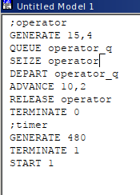
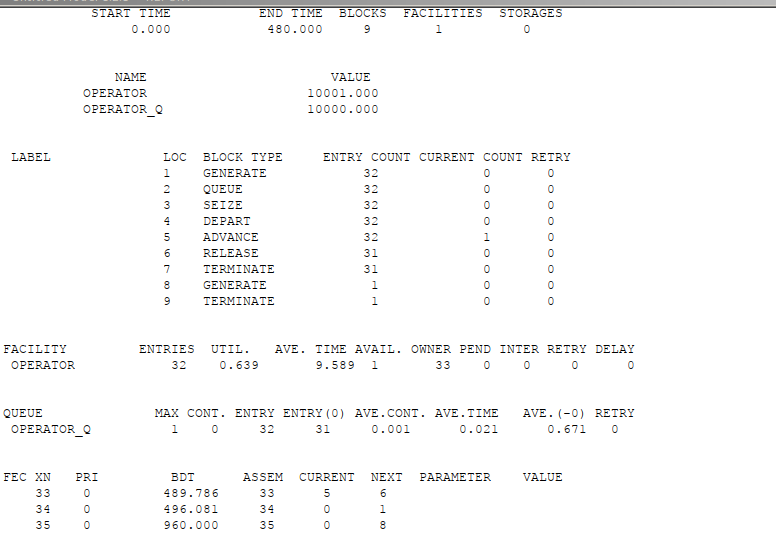
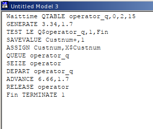
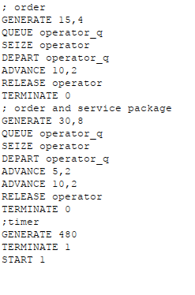
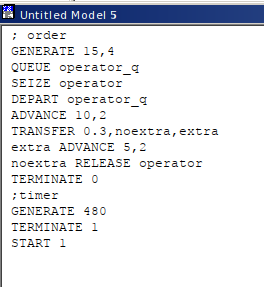
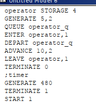

---
## Front matter
lang: ru-RU
title: "Лабораторная работа №14"
subtitle: "Модели обработки заказов"
author:
  - Эспиноса Василита К.М.
institute:
  - Российский университет дружбы народов, Москва, Россия

date: 10/05/2025

## i18n babel
babel-lang: russian
babel-otherlangs: english

## Formatting pdf
toc: false
toc-title: Содержание
slide_level: 2
aspectratio: 169
section-titles: true
theme: metropolis
header-includes:
 - \metroset{progressbar=frametitle,sectionpage=progressbar,numbering=fraction}
---

# Информация

## Докладчик

:::::::::::::: {.columns align=center}
::: {.column width="70%"}

  * Эспиноса Василита Кристина Микаела
  * студентка
  * Российский университет дружбы народов
  * [1032224624@pfur.ru](mailto:1032224624@pfur.ru)
  * <https://github.com/crisespinosa/>

:::
::: {.column width="30%"}

:::
::::::::::::::

# Цель работы

Реализовать модели обработки заказов и провести анализ результатов.

# Задание

Реализовать с помощью gpss:

* модель оформления заказов клиентов одним оператором;
* построение гистограммы распределения заявок в очереди;
* модель обслуживания двух типов заказов от клиентов в интернет-магазине;
* модель оформления заказов несколькими операторами.

# Выполнение лабораторной работы

# Модель оформления заказов клиентов одним оператором

{#fig:001 width=70%}

# Модель оформления заказов клиентов одним оператором

После запуска симуляции получаем отчёт (рис. [-@fig:002]).

{#fig:002 width=70%}

# Модель оформления заказов клиентов одним оператором

**Упражнение**

{#fig:003 width=70%}

{#fig:004 width=70%}

# Построение гистограммы распределения заявок в очереди

{#fig:005 width=70%}

# Построение гистограммы распределения заявок в очереди

{#fig:006 width=70%}

# Построение гистограммы распределения заявок в очереди

Далее у нас полученый гистограмму:

{#fig:007 width=70%}

# Модель обслуживания двух типов заказов от клиентов в интернет-магазине

{#fig:008 width=70%}

# Модель обслуживания двух типов заказов от клиентов в интернет-магазине

{#fig:009 width=70%}

# Модель обслуживания двух типов заказов от клиентов в интернет-магазине

**Упражнение**

{#fig:010 width=70%}

# Модель обслуживания двух типов заказов от клиентов в интернет-магазине

{#fig:011 width=70%}

# Модель оформления заказов несколькими операторами

{#fig:012 width=70%}

# Модель оформления заказов несколькими операторами

Далее проанализируем отчёт (рис. [-@fig:-013])

{#fig:013 width=70%}

# Модель оформления заказов несколькими операторами

{#fig:014 width=70%}

# Модель оформления заказов несколькими операторами

Далее проанализируем отчёт (рис. [-@fig:-015])

{#fig:015 width=70%}

# Вывод

В результате была реализована с помощью gpss:

* модель оформления заказов клиентов одним оператором;
* построение гистограммы распределения заявок в очереди;
* модель обслуживания двух типов заказов от клиентов в интернет-магазине;
* модель оформления заказов несколькими операторами.

