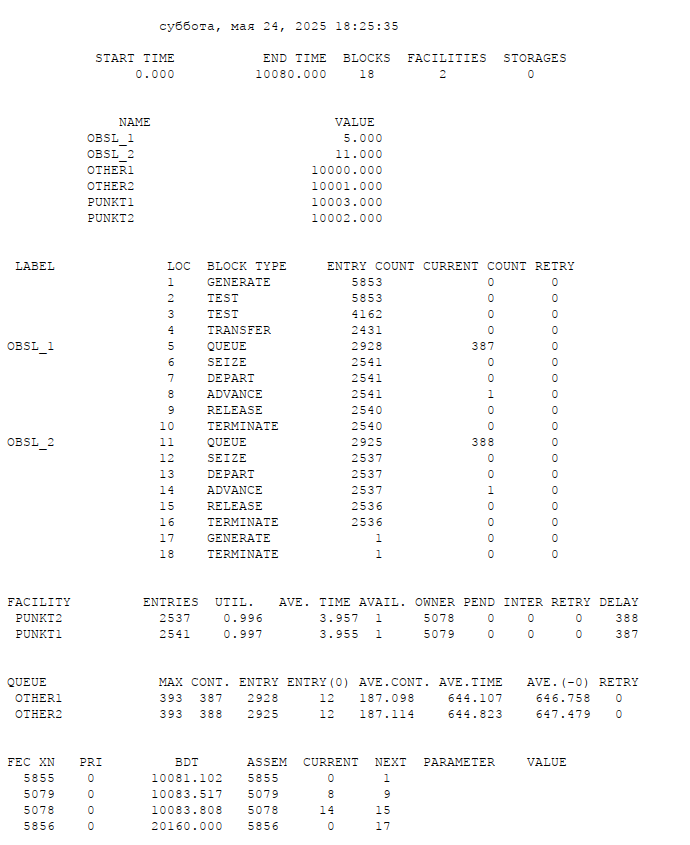
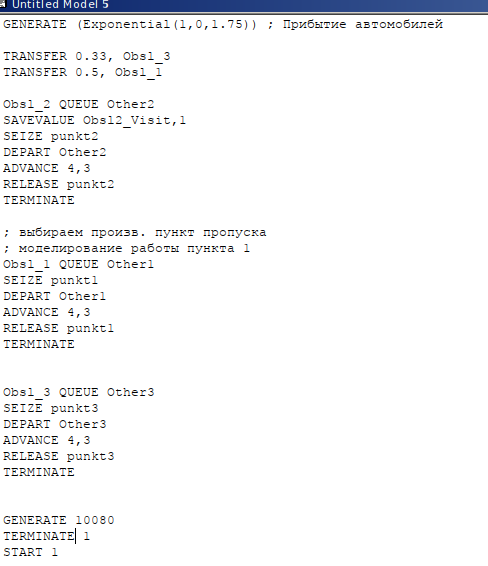
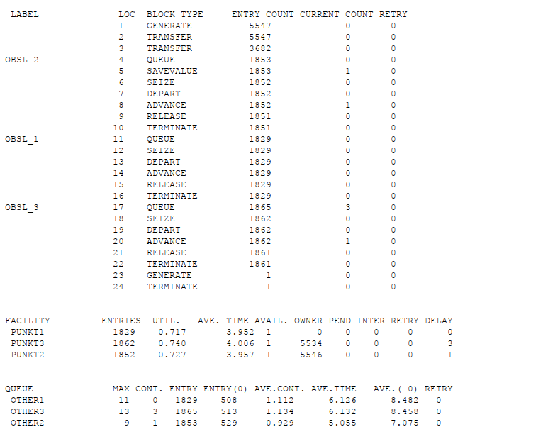
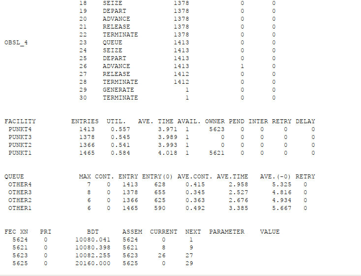
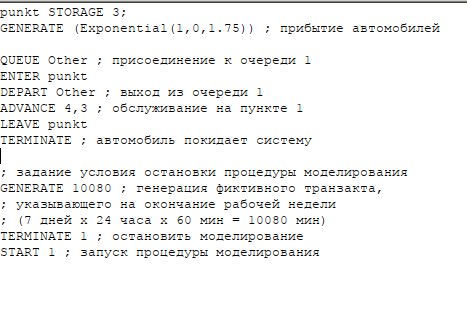
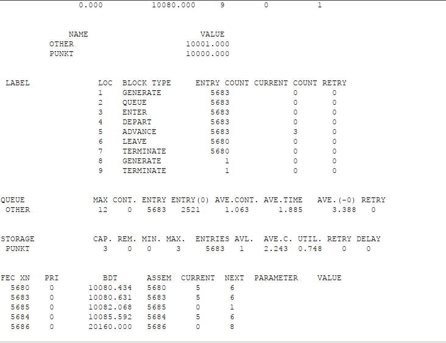
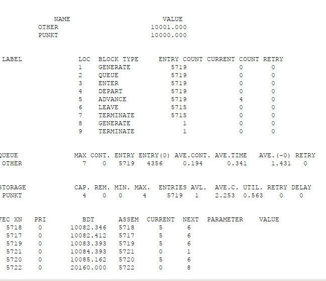

---
## Front matter
lang: ru-RU
title: "Лабораторная работа №16"
subtitle: "Задачи оптимизации. Модель двух стратегий обслуживания"
author:
  - Эспиноса Василита К.М.
institute:
  - Российский университет дружбы народов, Москва, Россия

date: 24/05/2025

## i18n babel
babel-lang: russian
babel-otherlangs: english

## Formatting pdf
toc: false
toc-title: Содержание
slide_level: 2
aspectratio: 169
section-titles: true
theme: metropolis
header-includes:
 - \metroset{progressbar=frametitle,sectionpage=progressbar,numbering=fraction}
---

# Информация

## Докладчик

:::::::::::::: {.columns align=center}
::: {.column width="70%"}

  * Эспиноса Василита Кристина Микаела
  * студентка
  * Российский университет дружбы народов
  * [1032224624@pfur.ru](mailto:1032224624@pfur.ru)
  * <https://github.com/crisespinosa/>

:::
::: {.column width="30%"}

:::
::::::::::::::

# Цель работы

Реализовать с помощью gpss модель двух стратегий обслуживания и оценить оптимальные параметры.

# Задание

Реализовать с помощью gpss:

* Модель с двумя очередями;
* Модель с одной очередью;
* изменить модели, чтобы определить оптимальное число пропускных пунктов.

# Выполнение лабораторной работы

# Постановка задачи

На пограничном контрольно-пропускном пункте транспорта имеются 2 пункта пропуска. Интервалы времени между поступлением автомобилей имеют экспоненциальное распределение со средним значением 
μ, Время прохождения автомобилями пограничного контроля имеет равномерное распределение на интервале [a,b] Предлагается две стратегии обслуживания прибывающих автомобилей:

1. aвтомобили образуют две очереди и обслуживаются соответствующими пунктами пропуска;
2. автомобили образуют одну общую очередь и обслуживаются освободившимся пунктом пропуска. Исходные данные: μ=1,75 мин, а= 1 мин, b= 7 мин

# Построение модели

Целью моделирования является определение:

* характеристик качества обслуживания автомобилей, в частности, средних длин очередей; среднего времени обслуживания автомобиля; среднего времени пребывания автомобиля на пункте пропуска;
* наилучшей стратегии обслуживания автомобилей на пункте пограничного контроля;
* оптимального количества пропускных пунктов.

В качестве критериев, используемых для сравнения стратегий обслуживания автомобилей, выберем:

* коэффициенты загрузки системы;
* максимальные и средние длины очередей;
* средние значения времени ожидания обслуживания.

# Построение модели

{#fig:001 width=70%}

# Построение модели

{#fig:002 width=70%}

# Построение модели

{#fig:003 width=70%}

# Построение модели

{#fig:004 width=70%}

# Построение модели

Составим таблицу по полученной статистике (рис. [-@fig:005])

{#fig:005 width=70%}

# Построение модели

Здесь можно отметить, что первая модель позволяет обслужить больше автомобилей в общем. Тем не менее, во второй модели разница между числом поступивших и обслуженных машин меньше, что говорит о более высокой эффективности. Кроме того, коэффициент загрузки во второй стратегии составляет 1, что означает отсутствие простоев на всех пунктах. Также для второй модели наблюдаются меньшие значения по максимальной и средней длине очереди, а также по среднему времени ожидания. Это позволяет сделать вывод, что вторая стратегия является более оптимальной.

# Оптимизация модели двух стратегий обслуживания

Изменим модели, чтобы определить оптимальное число пропускных пунктов (от 1 до 4). Будем подбирать под следующие критерии:

* коэффициент загрузки пропускных пунктов принадлежит интервалу [0, 5; 0, 95];
* среднее число автомобилей, одновременно находящихся на контрольно пропускном пункте, не должно превышать 3;
* среднее время ожидания обслуживания не должно превышать 4 мин.

# Оптимизация модели двух стратегий обслуживания

{#fig:006 width=70%}

# Оптимизация модели двух стратегий обслуживания

{#fig:007 width=70%}

# Оптимизация модели двух стратегий обслуживания

{#fig:008 width=70%}

# Оптимизация модели двух стратегий обслуживания

{#fig:009 width=70%}

# Оптимизация модели двух стратегий обслуживания

{#fig:010 width=70%}

# Оптимизация модели двух стратегий обслуживания

{#fig:011 width=70%}

# Оптимизация модели двух стратегий обслуживания

{#fig:012 width=70%}

# Оптимизация модели двух стратегий обслуживания

{#fig:013 width=70%}

# Оптимизация модели двух стратегий обслуживания

{#fig:014 width=70%}

# Оптимизация модели двух стратегий обслуживания

{#fig:015 width=70%}

# Вывод

В результате выполнения работы реализовалв с помощбю gpss:

* Модель с двумя очередями;
* Модель с одной очередью;
* изменить модели, чтобы определить оптимальное число пропускных пунктов..

# Список литературы {.unnumbered}

::: {#refs}
Королькова А. В., Кулябов Д. С. *Моделирование информационных процессов: учебное пособие*. — Москва: РУДН, 2020. — С. 148–149.
:::

