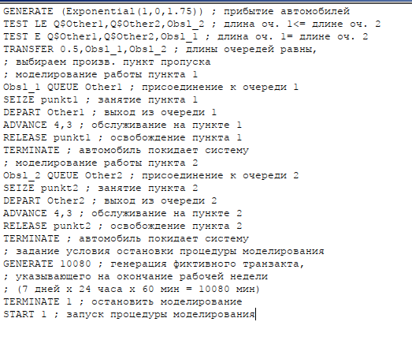
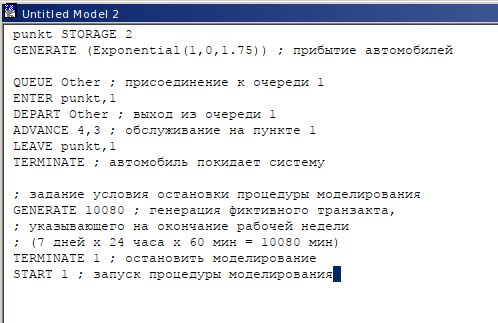
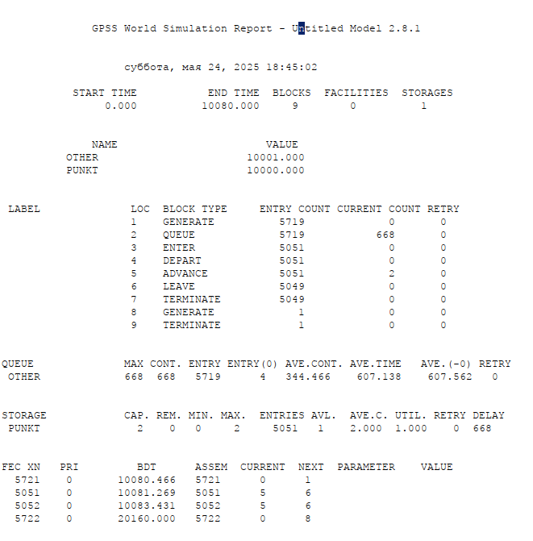
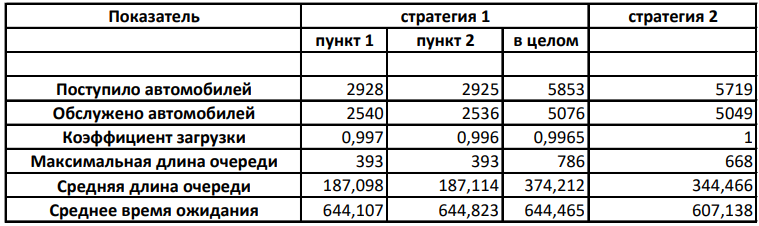
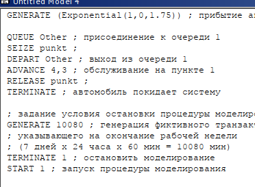
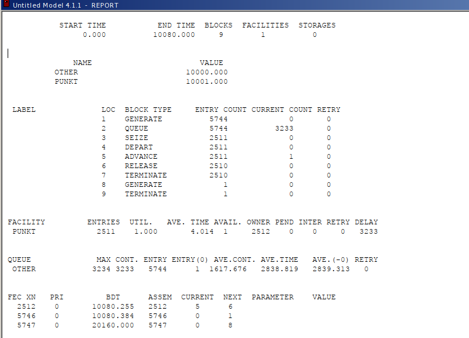
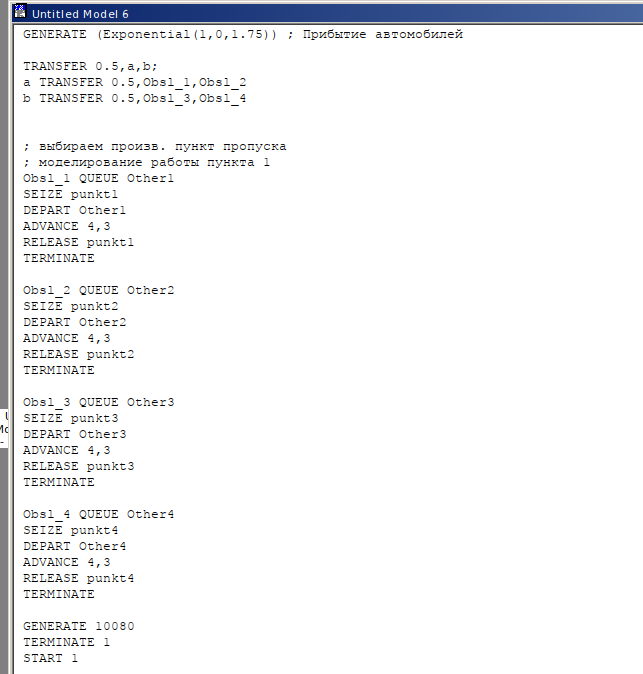
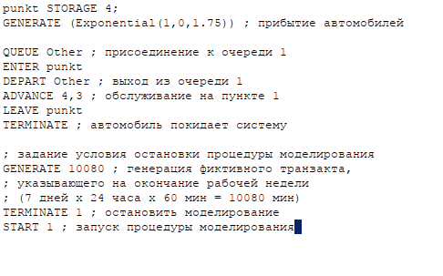

---
## Front matter
title: "Лабораторная работа №16"
subtitle: "Задачи оптимизации. Модель двух стратегий обслуживания"
author: "Эспиноса Василита Кристина Микаела"

## Generic otions
lang: ru-RU
toc-title: "Содержание"

## Bibliography
bibliography: bib/cite.bib
csl: pandoc/csl/gost-r-7-0-5-2008-numeric.csl

## Pdf output format
toc: true # Table of contents
toc-depth: 2
lof: true # List of figures
lot: true # List of tables
fontsize: 12pt
linestretch: 1.5
papersize: a4
documentclass: scrreprt
## I18n polyglossia
polyglossia-lang:
  name: russian
  options:
	- spelling=modern
	- babelshorthands=true
polyglossia-otherlangs:
  name: english
## I18n babel
babel-lang: russian
babel-otherlangs: english
## Fonts
mainfont: IBM Plex Serif
romanfont: IBM Plex Serif
sansfont: IBM Plex Sans
monofont: IBM Plex Mono
mathfont: STIX Two Math
mainfontoptions: Ligatures=Common,Ligatures=TeX,Scale=0.94
romanfontoptions: Ligatures=Common,Ligatures=TeX,Scale=0.94
sansfontoptions: Ligatures=Common,Ligatures=TeX,Scale=MatchLowercase,Scale=0.94
monofontoptions: Scale=MatchLowercase,Scale=0.94,FakeStretch=0.9
mathfontoptions:
## Biblatex
biblatex: true
biblio-style: "gost-numeric"
biblatexoptions:
  - parentracker=true
  - backend=biber
  - hyperref=auto
  - language=auto
  - autolang=other*
  - citestyle=gost-numeric
## Pandoc-crossref LaTeX customization
figureTitle: "Рис."
tableTitle: "Таблица"
listingTitle: "Листинг"
lofTitle: "Список иллюстраций"
lotTitle: "Список таблиц"
lolTitle: "Листинги"
## Misc options
indent: true
header-includes:
  - \usepackage{indentfirst}
  - \usepackage{float} # keep figures where there are in the text
  - \floatplacement{figure}{H} # keep figures where there are in the text
---

# Цель работы

Реализовать с помощью gpss модель двух стратегий обслуживания и оценить оптимальные параметры.

# Задание

Реализовать с помощью gpss:

* Модель с двумя очередями;
* Модель с одной очередью;
* изменить модели, чтобы определить оптимальное число пропускных пунктов.

# Выполнение лабораторной работы

## Постановка задачи

На пограничном контрольно-пропускном пункте транспорта имеются 2 пункта пропуска. Интервалы времени между поступлением автомобилей имеют экспоненциальное распределение со средним значением 
μ, Время прохождения автомобилями пограничного контроля имеет равномерное распределение на интервале [a,b] Предлагается две стратегии обслуживания прибывающих автомобилей:

1. aвтомобили образуют две очереди и обслуживаются соответствующими пунктами пропуска;
2. автомобили образуют одну общую очередь и обслуживаются освободившимся пунктом пропуска. Исходные данные: μ=1,75 мин, а= 1 мин, b= 7 мин

## Построение модели

Целью моделирования является определение:

* характеристик качества обслуживания автомобилей, в частности, средних длин очередей; среднего времени обслуживания автомобиля; среднего времени пребывания автомобиля на пункте пропуска;
* наилучшей стратегии обслуживания автомобилей на пункте пограничного контроля;
* оптимального количества пропускных пунктов.

В качестве критериев, используемых для сравнения стратегий обслуживания автомобилей, выберем:

* коэффициенты загрузки системы;
* максимальные и средние длины очередей;
* средние значения времени ожидания обслуживания.

Для первой стратегии обслуживания, когда прибывающие автомобили образуют две очереди и обслуживаются соответствующими пропускными пунктами, имеем следующую модель (рис. [-@fig:001]).

{#fig:001 width=70%}

После запуска симуляции получаем отчёт (рис. [-@fig:002]).

{#fig:002 width=70%}

Составим модель для второй стратегии обслуживания, когда прибывающие автомобили образуют одну очередь и обслуживаются освободившимся пропускным пунктом (рис. [-@fig:003], [-@fig:004]).

{#fig:003 width=70%}

{#fig:004 width=70%}

Составим таблицу по полученной статистике (рис. [-@fig:005])

{#fig:005 width=70%}

Здесь можно отметить, что первая модель позволяет обслужить больше автомобилей в общем. Тем не менее, во второй модели разница между числом поступивших и обслуженных машин меньше, что говорит о более высокой эффективности. Кроме того, коэффициент загрузки во второй стратегии составляет 1, что означает отсутствие простоев на всех пунктах. Также для второй модели наблюдаются меньшие значения по максимальной и средней длине очереди, а также по среднему времени ожидания. Это позволяет сделать вывод, что вторая стратегия является более оптимальной.

## Оптимизация модели двух стратегий обслуживания

Изменим модели, чтобы определить оптимальное число пропускных пунктов (от 1 до 4). Будем подбирать под следующие критерии:

* коэффициент загрузки пропускных пунктов принадлежит интервалу [0, 5; 0, 95];
* среднее число автомобилей, одновременно находящихся на контрольно пропускном пункте, не должно превышать 3;
* среднее время ожидания обслуживания не должно превышать 4 мин.

Для обеих стратегий модель с одним пунктом выглядит одинаково (рис. [-@fig:006])

{#fig:006 width=70%}

После запуска симуляции получаем отчёт (рис. [-@fig:007]).

{#fig:007 width=70%}

В данной ситуации модель не удовлетворяет ни одному из критериев, поскольку коэффициент загрузки, длина очереди и среднее время ожидания оказываются выше допустимых значений.

Рассмотрим модель для первой стратегии, включающую три пункта пропуска, и проанализируем отчетные данные (см. рис. [-@fig:008], [-@fig:009]).

{#fig:008 width=70%}

{#fig:009 width=70%}

В данной ситуации средняя длина очереди составляет менее трёх автомобилей, а коэффициент загрузки находится в допустимых пределах, однако среднее время ожидания превышает значение 4.

Построим модель для первой стратегии, включающую четыре пропускных пункта (см. рис. [-@fig:010], [-@fig:011]).

{#fig:010 width=70%}

{#fig:011 width=70%}

В этом случае все критерии выполнены, поэтому 4 пункта являются оптимальным количеством для первой стратегии.

Построим модель для второй стратегии с 3 пропускными пунктами и получим отчет (см. рис. [-@fig:012], [-@fig:013]).

{#fig:012 width=70%}

{#fig:013 width=70%}

В этом случае все критерии выполняются, поэтому модель оптимальна.

Построим модель для второй стратегии с 4 пропускными пунктами и получим отчет (см. рис. [-@fig:014], [-@fig:015]).

{#fig:014 width=70%}

{#fig:015 width=70%}

В данном случае все критерии выполнены: и среднее время ожидания, и количество автомобилей в очереди ниже, чем во второй стратегии с тремя пунктами. Однако коэффициент загрузки также ниже, что свидетельствует о том, что четвёртый пункт избыточно разгружает систему.

Таким образом, по результатам анализа оптимальное количество пунктов пропуска составляет три для второй стратегии обслуживания и четыре — для первой.

# Вывод

В результате выполнения работы реализовалв с помощбю gpss:

* Модель с двумя очередями;
* Модель с одной очередью;
* изменить модели, чтобы определить оптимальное число пропускных пунктов..

# Список литературы {.unnumbered}

::: {#refs}
Королькова А. В., Кулябов Д. С. *Моделирование информационных процессов: учебное пособие*. — Москва: РУДН, 2020. — С. 148–149.
:::
