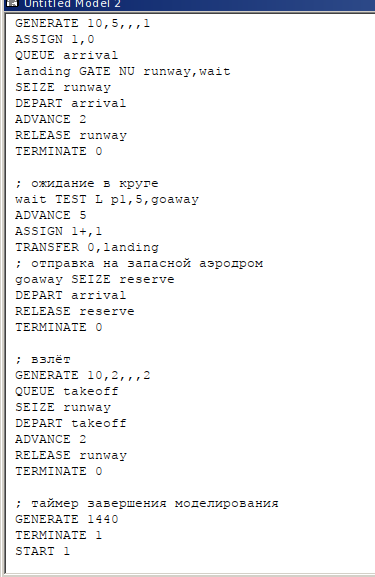
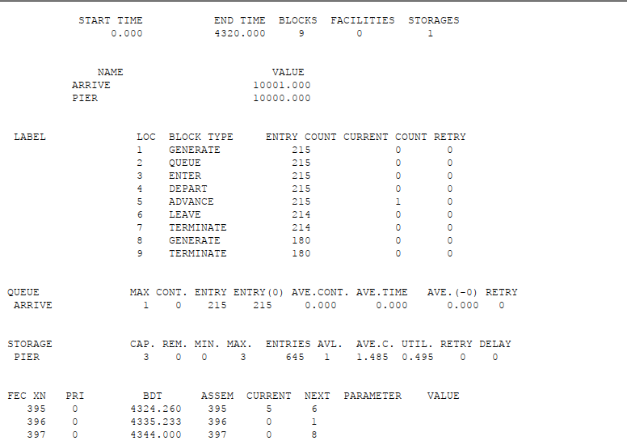
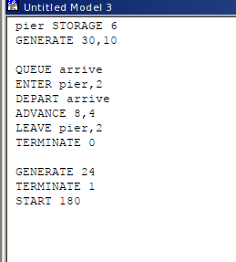
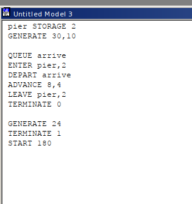

---
## Front matter
lang: ru-RU
title: "Лабораторная работа №17"
subtitle: "Задания для самостоятельной работы"
author:
  - Эспиноса Василита К.М.
institute:
  - Российский университет дружбы народов, Москва, Россия

date: 31/05/2025

## i18n babel
babel-lang: russian
babel-otherlangs: english

## Formatting pdf
toc: false
toc-title: Содержание
slide_level: 2
aspectratio: 169
section-titles: true
theme: metropolis
header-includes:
 - \metroset{progressbar=frametitle,sectionpage=progressbar,numbering=fraction}
---

# Информация

## Докладчик

:::::::::::::: {.columns align=center}
::: {.column width="70%"}

  * Эспиноса Василита Кристина Микаела
  * студентка
  * Российский университет дружбы народов
  * [1032224624@pfur.ru](mailto:1032224624@pfur.ru)
  * <https://github.com/crisespinosa/>

:::
::: {.column width="30%"}

:::
::::::::::::::

# Цель работы

Реализовать с помощью gpss модель работы вычислительного центра, аэропорта и морского порта.

# Задание

Реализовать с помощью gpss:

* модель работы вычислительного центра;
* модель работы аэропорта;
* модель работы морского порта.

# Выполнение лабораторной работы

# Моделирование работы вычислительного центра

На вычислительном центре в обработку принимаются три класса заданий А, В и С. Исходя из наличия оперативной памяти ЭВМ задания классов А и В могут решаться одновременно, а задания класса С монополизируют ЭВМ. Задачи класса С загружаются в ЭВМ, если она полностью свободна. Задачи классов А и В могут дозагружаться к решающей задаче.
Смоделировать работу ЭВМ за 80 ч. Определить её загрузку

# Моделирование работы вычислительного центра

{#fig:001 width=70%}

# Моделирование работы вычислительного центра

{#fig:002 width=70%}

# Модель работы аэропорта
Самолёты прибывают для посадки в район аэропорта каждые 10±5 мин. Если взлетно-посадочная полоса свободна, прибывший самолёт получает разрешение на посадку. Если полоса занята, самолет выполняет полет по кругу и возвращается в аэропорт каждые 5 мин. Если после пятого круга самолет не получает разрешения на посадку, он отправляется на запасной аэродром.
В аэропорту через каждые 10±2 мин к взлетно -посадочной полосе выруливают готовые к взлёту самолёты и получают разрешение на взлёт, если полоса свободна. Для взлета и посадки самолёты занимают полосу ровно на 2 мин. Если при свободной полосе одновременно один самолёт прибывает для посадки, а другой -- для взлёта, то полоса предоставляется взлетающей машине.

Требуется:

* выполнить моделирование работы аэропорта в течение суток;
* подсчитать количество самолётов, которые взлетели, сели и были направлены на запасной аэродром;
* определить коэффициент загрузки взлетно-посадочной полосы.

# Модель работы аэропорта

{#fig:003 width=70%}

# Модель работы аэропорта

{#fig:004 width=70%}

# Моделирование работы морского порта

Морские суда прибывают в порт каждые 
\[ \alpha \pm \delta \] часов. 
В порту имеется **N** причалов. 
Каждое судно по длине занимает **M** причалов и находится в порту 
\[ b \pm \varepsilon \] часов.
Требуется построить **GPSS-модель** для анализа работы морского порта в течение **полугода**, а также определить **оптимальное количество причалов** для эффективной работы.

 **Вариант 1:**
- \( \alpha = 20 \) ч 
- \( \delta = 5 \) ч 
- \( b = 10 \) ч 
- \( \varepsilon = 3 \) ч 
- \( N = 10 \) (причалов) 
- \( M = 3 \) (причала на одно судно)

 **Вариант 2:**
- \( \alpha = 30 \) ч 
- \( \delta = 10 \) ч 
- \( b = 8 \) ч 
- \( \varepsilon = 4 \) ч 
- \( N = 6 \) (причалов) 
- \( M = 2 \) (причала на одно судно)

# Моделирование работы морского порта

**Первый вариант модели**

{#fig:005 width=70%}

# Моделирование работы морского порта

{#fig:006 width=70%}

# Моделирование работы морского порта

{#fig:007 width=70%}

# Моделирование работы морского порта

{#fig:008 width=70%}

# Моделирование работы морского порта

**Второй вариант модели**

{#fig:009 width=70%}

# Моделирование работы морского порта

{#fig:010 width=70%}

# Моделирование работы морского порта

{#fig:011 width=70%}

# Моделирование работы морского порта

{#fig:012 width=70%}

# Вывод

В результате выполнения работы реализовалв с помощбю gpss:

* модель работы вычислительного центра;
* модель работы аэропорта;
* модель работы морского порта.

# Список литературы {.unnumbered}

::: {#refs}
Королькова А. В., Кулябов Д. С. *Моделирование информационных процессов: учебное пособие*. — Москва: РУДН, 2020. — С. 150.
:::
