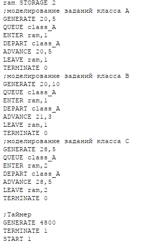
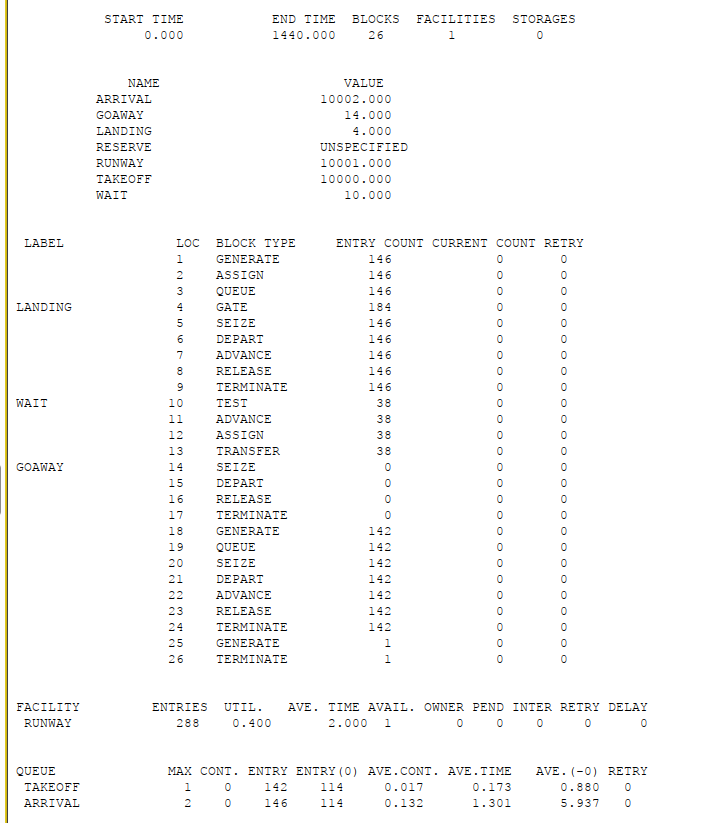
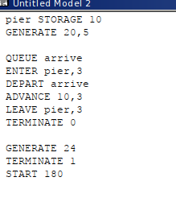
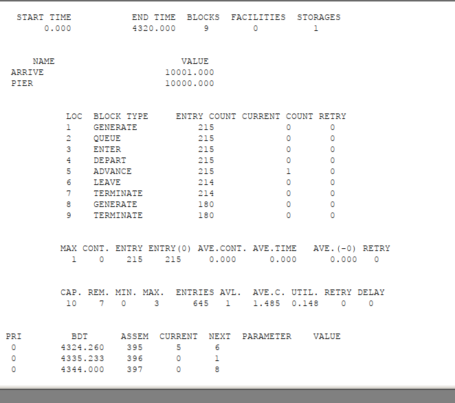
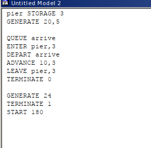
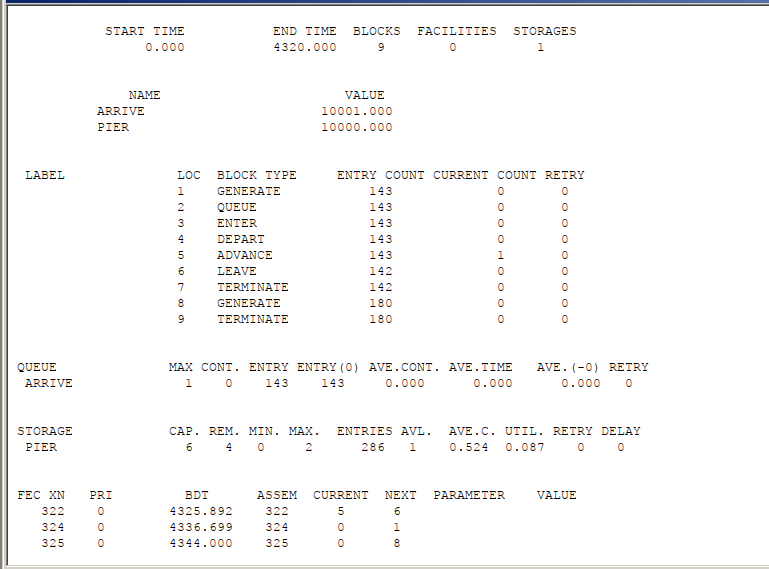
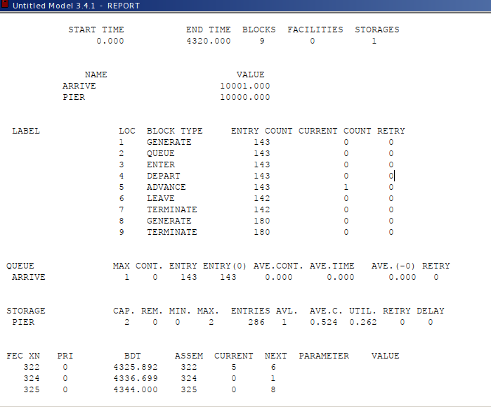

---
## Front matter
title: "Лабораторная работа №17"
subtitle: "Задания для самостоятельной работы"
author: "Эспиноса Василита Кристина Микаела"

## Generic otions
lang: ru-RU
toc-title: "Содержание"

## Bibliography
bibliography: bib/cite.bib
csl: pandoc/csl/gost-r-7-0-5-2008-numeric.csl

## Pdf output format
toc: true # Table of contents
toc-depth: 2
lof: true # List of figures
lot: true # List of tables
fontsize: 12pt
linestretch: 1.5
papersize: a4
documentclass: scrreprt
## I18n polyglossia
polyglossia-lang:
  name: russian
  options:
	- spelling=modern
	- babelshorthands=true
polyglossia-otherlangs:
  name: english
## I18n babel
babel-lang: russian
babel-otherlangs: english
## Fonts
mainfont: IBM Plex Serif
romanfont: IBM Plex Serif
sansfont: IBM Plex Sans
monofont: IBM Plex Mono
mathfont: STIX Two Math
mainfontoptions: Ligatures=Common,Ligatures=TeX,Scale=0.94
romanfontoptions: Ligatures=Common,Ligatures=TeX,Scale=0.94
sansfontoptions: Ligatures=Common,Ligatures=TeX,Scale=MatchLowercase,Scale=0.94
monofontoptions: Scale=MatchLowercase,Scale=0.94,FakeStretch=0.9
mathfontoptions:
## Biblatex
biblatex: true
biblio-style: "gost-numeric"
biblatexoptions:
  - parentracker=true
  - backend=biber
  - hyperref=auto
  - language=auto
  - autolang=other*
  - citestyle=gost-numeric
## Pandoc-crossref LaTeX customization
figureTitle: "Рис."
tableTitle: "Таблица"
listingTitle: "Листинг"
lofTitle: "Список иллюстраций"
lotTitle: "Список таблиц"
lolTitle: "Листинги"
## Misc options
indent: true
header-includes:
  - \usepackage{indentfirst}
  - \usepackage{float} # keep figures where there are in the text
  - \floatplacement{figure}{H} # keep figures where there are in the text
---

# Цель работы

Реализовать с помощью gpss модель работы вычислительного центра, аэропорта и морского порта.

# Задание

Реализовать с помощью gpss:

* модель работы вычислительного центра;
* модель работы аэропорта;
* модель работы морского порта.

# Выполнение лабораторной работы

## Моделирование работы вычислительного центра

На вычислительном центре в обработку принимаются три класса заданий А, В и С. Исходя из наличия оперативной памяти ЭВМ задания классов А и В могут решаться одновременно, а задания класса С монополизируют ЭВМ. Задачи класса С загружаются в ЭВМ, если она полностью свободна. Задачи классов А и В могут дозагружаться к решающей задаче.
Смоделировать работу ЭВМ за 80 ч. Определить её загрузку

Построим модель (рис. [-@fig:001]). Создаётся хранилище ram с вместимостью на две заявки. Далее идут три блока обработки: первые два предназначены для заданий классов A и B, которые используют по одному элементу ram, а третий — для заданий класса C, которым требуются оба элемента памяти. В завершение добавлен временной блок, задающий длительность моделирования в 4800 минут (то есть 80 часов).

{#fig:001 width=70%}

После запуска симуляции получаем отчёт (рис. [-@fig:002]). Согласно отчету, коэффициент загрузки системы составляет 0.994.

{#fig:002 width=70%}

## Модель работы аэропорта
Самолёты прибывают для посадки в район аэропорта каждые 10±5 мин. Если взлетно-посадочная полоса свободна, прибывший самолёт получает разрешение на посадку. Если полоса занята, самолет выполняет полет по кругу и возвращается в аэропорт каждые 5 мин. Если после пятого круга самолет не получает разрешения на посадку, он отправляется на запасной аэродром.
В аэропорту через каждые 10±2 мин к взлетно -посадочной полосе выруливают готовые к взлёту самолёты и получают разрешение на взлёт, если полоса свободна. Для взлета и посадки самолёты занимают полосу ровно на 2 мин. Если при свободной полосе одновременно один самолёт прибывает для посадки, а другой -- для взлёта, то полоса предоставляется взлетающей машине.

Требуется:

* выполнить моделирование работы аэропорта в течение суток;
* подсчитать количество самолётов, которые взлетели, сели и были направлены на запасной аэродром;
* определить коэффициент загрузки взлетно-посадочной полосы.

Построим модель (рис. [-@fig:003]). Блок, обрабатывающий вылетающие самолёты, имеет приоритет 2, а для прилетающих — приоритет 1 (чем выше число, тем выше приоритет). Выполняется проверка: если взлётно-посадочная полоса свободна, заявка обрабатывается сразу, иначе происходит переход в блок ожидания. В режиме ожидания самолёт выполняет до пяти кругов, каждый раз проверяя, освободилась ли полоса. Если да — продолжается посадка; если нет — самолёт перенаправляется на запасной аэродром. Время моделирования задаётся как 1440 минут (24 часа).

{#fig:003 width=70%}

После запуска симуляции получаем отчёт (рис. [-@fig:004]). В течение моделирования взлетели 142 самолёта, приземлились — 146, а на запасной аэродром не было направлено ни одного. Это объясняется тем, что время обработки (2 минуты) значительно меньше времени между поступлениями новых самолётов, поэтому очередь почти не формируется. Коэффициент загрузки взлётно-посадочной полосы составил всего 0.4, что указывает на её недостаточное использование — большую часть времени полоса остаётся свободной.

{#fig:004 width=70%}

## Моделирование работы морского порта

Морские суда прибывают в порт каждые 
\[ \alpha \pm \delta \] часов. 
В порту имеется **N** причалов. 
Каждое судно по длине занимает **M** причалов и находится в порту 
\[ b \pm \varepsilon \] часов.
Требуется построить **GPSS-модель** для анализа работы морского порта в течение **полугода**, а также определить **оптимальное количество причалов** для эффективной работы.

#### **Вариант 1:**
- \( \alpha = 20 \) ч 
- \( \delta = 5 \) ч 
- \( b = 10 \) ч 
- \( \varepsilon = 3 \) ч 
- \( N = 10 \) (причалов) 
- \( M = 3 \) (причала на одно судно)

#### **Вариант 2:**
- \( \alpha = 30 \) ч 
- \( \delta = 10 \) ч 
- \( b = 8 \) ч 
- \( \varepsilon = 4 \) ч 
- \( N = 6 \) (причалов) 
- \( M = 2 \) (причала на одно судно)

**Первый вариант модели**

Построим модель для первого варианта (рис. [-@fig:005]).

{#fig:005 width=70%}

После запуска симуляции получаем отчёт (рис. [-@fig:006]). При запуске с 10 причалами видно, что судна обрабатываются быстрее, чем успевают приходить новые, так как очередь не набирается. Кроме того загруженность причалов очень низкая.

{#fig:006 width=70%}

Соответственно, установив наименьшее возможное число причалов -- 3 (рис. [-@fig:007]), получаем оптимальный результат, что видно на отчете (рис. [-@fig:008]).

{#fig:007 width=70%}

{#fig:008 width=70%}

**Второй вариант модели**

Построим модель для второго варианта (рис. [-@fig:009]).

{#fig:009 width=70%}

После запуска симуляции получаем отчёт (рис. [-@fig:010]). При запуске с 6 причалами видно, что судна обрабатываются быстрее, чем успевают приходить новые, так как очередь не набирается. Кроме того загруженность причалов очень низкая.

{#fig:010 width=70%}

Соответственно, установив наименьшее возможное число причалов -- 2 (рис. [-@fig:011]), получаем оптимальный результат, что видно из отчета (рис. [-@fig:012]).

{#fig:011 width=70%}

{#fig:012 width=70%}

# Вывод

В результате выполнения работы реализовалв с помощбю gpss:

* модель работы вычислительного центра;
* модель работы аэропорта;
* модель работы морского порта.

# Список литературы {.unnumbered}

::: {#refs}
Королькова А. В., Кулябов Д. С. *Моделирование информационных процессов: учебное пособие*. — Москва: РУДН, 2020. — С. 150.
:::
