---
## Front matter
lang: ru-RU
title: "Лабораторная работа №2"
subtitle: Исследование протокола TCP и алгоритма управления очередью RED 
author:
  - Эспиноса Василита К.М.
institute:
  - Российский университет дружбы народов, Москва, Россия

date: 12/04/2025

## i18n babel
babel-lang: russian
babel-otherlangs: english

## Formatting pdf
toc: false
toc-title: Содержание
slide_level: 2
aspectratio: 169
section-titles: true
theme: metropolis
header-includes:
 - \metroset{progressbar=frametitle,sectionpage=progressbar,numbering=fraction}
---

# Информация

## Докладчик

:::::::::::::: {.columns align=center}
::: {.column width="70%"}

  * Эспиноса Василита Кристина Микаела
  * студентка
  * Российский университет дружбы народов
  * [1032224624@pfur.ru](mailto:1032224624@pfur.ru)
  * <https://github.com/crisespinosa/>

:::
::: {.column width="30%"}

:::
::::::::::::::

# Цель работы

Исследовать протокол TCP и алгоритм управления очередью RED.

# Задание

- Выполнить пример с дисциплиной RED;
- Изменить в модели на узле s1 тип протокола TCP с Reno на NewReno, затем на Vegas. Сравнить и пояснить результаты;
- Внести изменения при отображении окон с графиками (изменить цвет фона, цвет траекторий, подписи к осям, подпись траектории в легенде).

# Выполнение лабораторной работы

Описание моделируемой сети:

– сеть состоит из 6 узлов;
– между всеми узлами установлено дуплексное соединение с различными пропуск-
ной способностью и задержкой 10 мс (см. рис. 2.4);
– узел r1 использует очередь с дисциплиной RED для накопления пакетов, макси-
мальный размер которой составляет 25;
– TCP-источники на узлах s1 и s2 подключаются к TCP-приёмнику на узле s3;
– генераторы трафика FTP прикреплены к TCP-агентам.

# Выполнение лабораторной работы

Разработаем сценирий, реализующий модель согласно описанию в Xgraph график изменения TCP-окна, график изменения длины очереди и средней длины очереди.

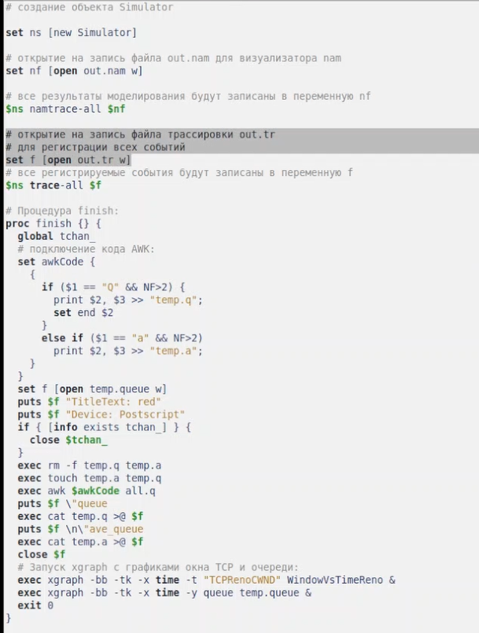{#fig:001 width=70%}

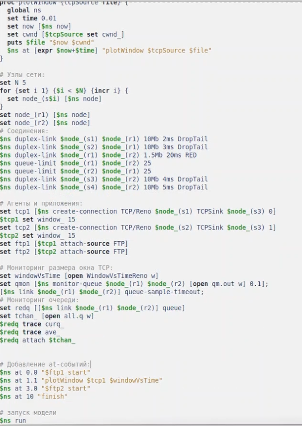{#fig:002 width=70%}

# Выполнение лабораторной работы

После запуска кода получаем график изменения TCP-окна (рис. [-@fig:003]), а также график изменения длины очереди и средней длины очереди (рис. [-@fig:004]).

Здесь видно, что средняя длина очереди находится в диапазоне от 2 до 4. Максимальная длина достигает значения 14.

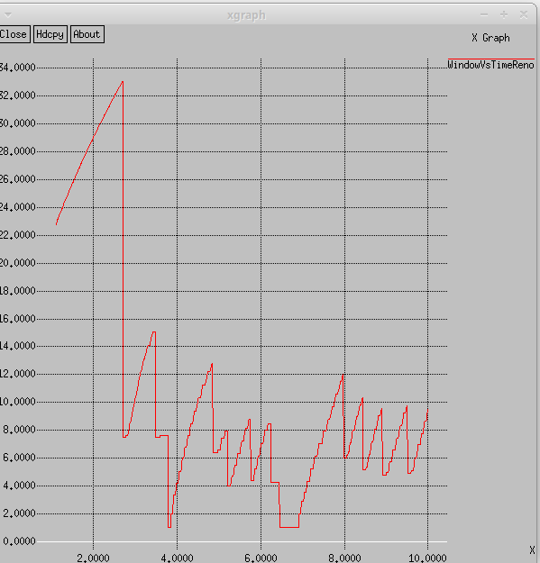{#fig:003 width=70%}

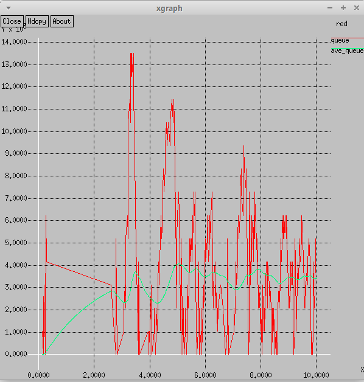{#fig:004 width=70%}

# Изменение протокола TCP 

Сначала именила тип Reno на NewReno. В результате получим следующие график изменения TCP-окна (рис. [-@fig:005]), а также график изменения длины очереди и средней длины очереди (рис. [-@fig:006]). 
Так же, как было в графике с типом Reno значение средней длины очереди находится в пределах от 2 до 4, а максимальное значение длины равно 14. 

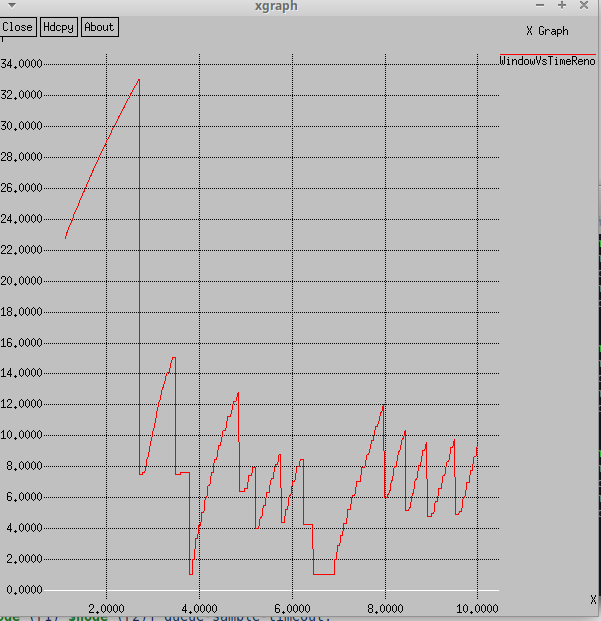{#fig:005 width=70%}

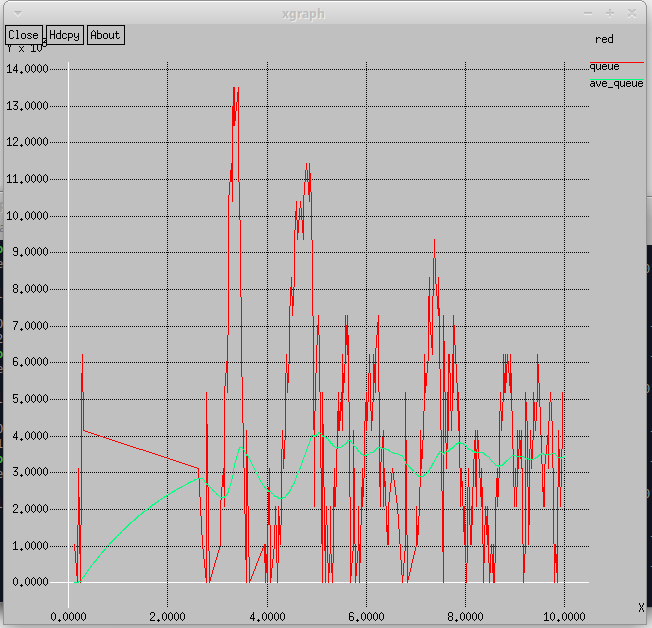{#fig:006 width=70%}

# Изменение протокола TCP

Далее изменим тип Reno на Vegas В результате получим следующие график изменения TCP-окна (рис. [-@fig:007]), а также график изменения длины очереди и средней длины очереди (рис. [-@fig:008]).
Средняя длина очереди при TCP Vegas остаётся в пределах 2–4, максимальная — 14. Размер окна у Vegas не превышает 20 (у NewReno — 34). TCP Vegas раньше обнаруживает перегрузку и уменьшает окно без потерь пакетов.

# Изменение протокола TCP

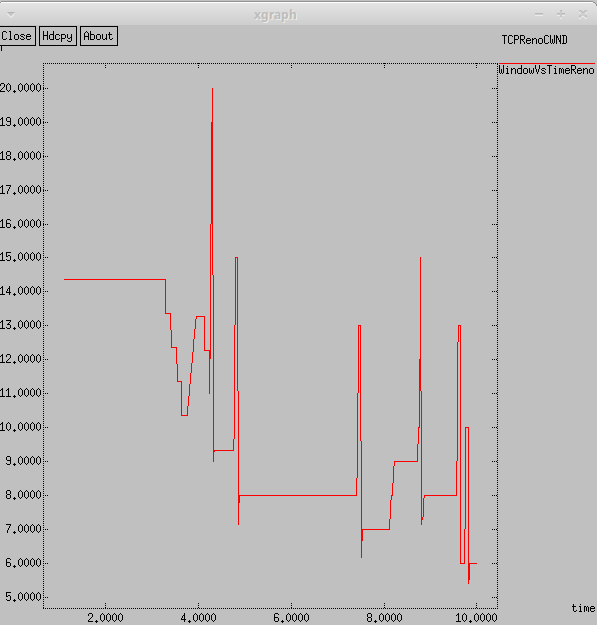{#fig:007 width=70%}

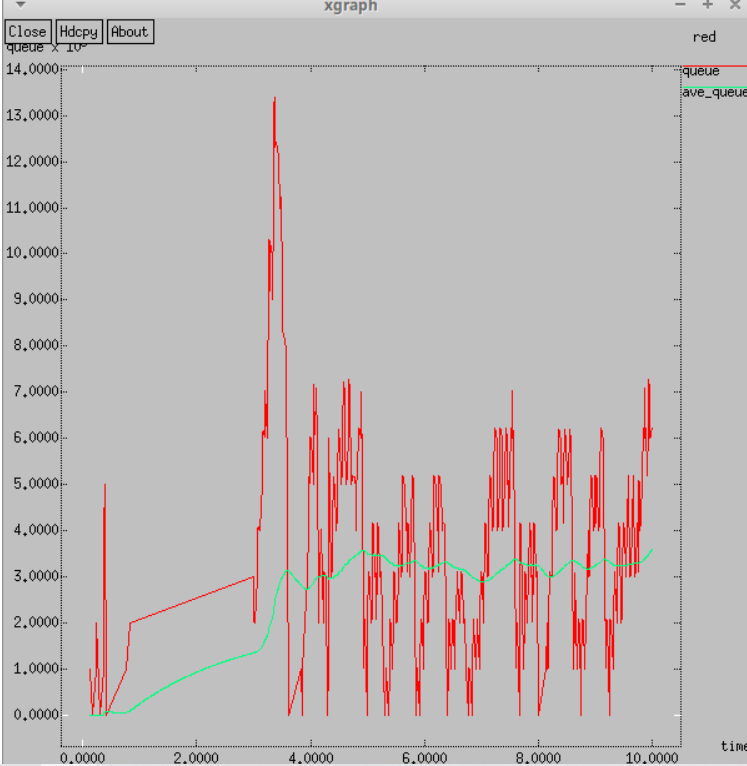{#fig:008 width=70%}

# Изменение отображения окон с графиками

Внесём корректировки в отображение графиков: поменяем цвет фона, цвет линий, подписи осей и название траектории в легенде. 
Для этого обновим код: в процедуре finish изменим цвет линий и подписей, а также с помощью опций -fg и -bg зададим новый цвет текста и фона в xgraph.

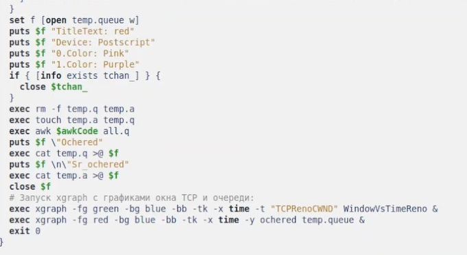{#fig:009 width=70%}

# Изменение отображения окон с графиками

В результате получим следующие график изменения TCP-окна (рис. [-@fig:011]), а также график изменения длины очереди и средней длины очереди (рис. [-@fig:010]).

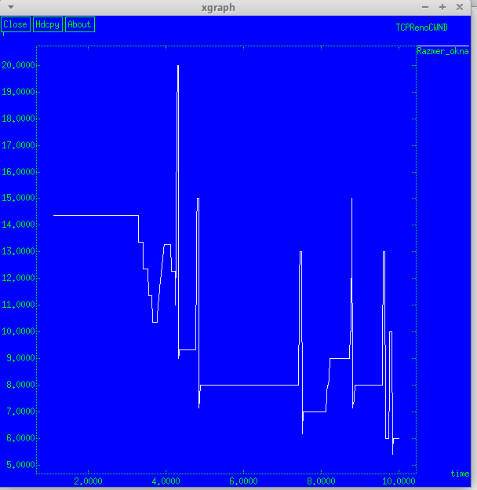{#fig:010 width=70%}

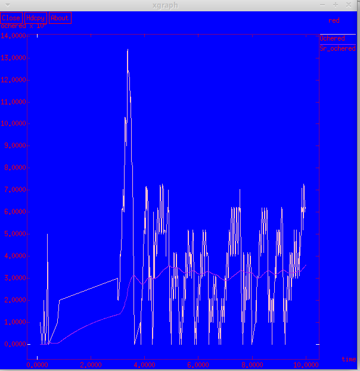{#fig:011 width=70%}

# Выводы

В процессе выполнения данной лабораторной работы я исследовала протокол TCP и алгоритм управления очередью RED.
