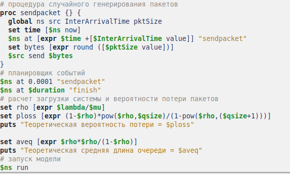
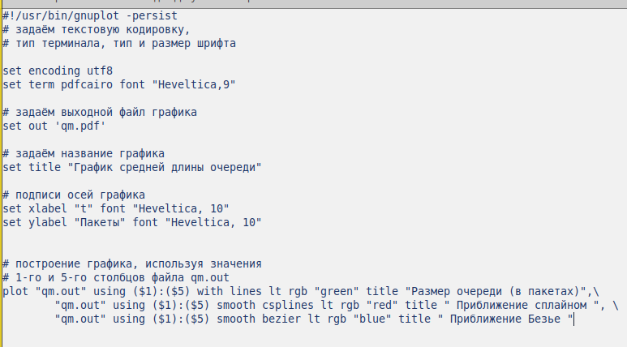

---
## Front matter
lang: ru-RU
title: "Лабораторная работа №3"
subtitle: оделирование стохастических процессов 
author:
  - Эспиноса Василита К.М.
institute:
  - Российский университет дружбы народов, Москва, Россия

date: 12/04/2025

## i18n babel
babel-lang: russian
babel-otherlangs: english

## Formatting pdf
toc: false
toc-title: Содержание
slide_level: 2
aspectratio: 169
section-titles: true
theme: metropolis
header-includes:
 - \metroset{progressbar=frametitle,sectionpage=progressbar,numbering=fraction}
---

# Информация

## Докладчик

:::::::::::::: {.columns align=center}
::: {.column width="70%"}

  * Эспиноса Василита Кристина Микаела
  * студентка
  * Российский университет дружбы народов
  * [1032224624@pfur.ru](mailto:1032224624@pfur.ru)
  * <https://github.com/crisespinosa/>

:::
::: {.column width="30%"}

:::
::::::::::::::

# Цель работы

Провести моделирование системы массового обслуживания (СМО).

# Задание

- Реализовать модель M|M|1; 
- Посчитать загрузку системы и вероятность потери пакетов;
- Построить график изменения размера очереди.

# Выполнение лабораторной работы

M|M|1 — однолинейная СМО с накопителем бесконечной ёмкости. Поступающий поток заявок — пуассоновский с интенсивностью \( \lambda \). Времена обслуживания
заявок — независимые в совокупности случайные величины, распределённые по экспоненциальному закону с параметром \( \mu \).

Перейдём к реализации системы. Зададим параметры: \( \lambda = 30 \), \( \mu = 33 \), размер очереди — 100000, длительность моделирования — 100000.
Определим узлы сети и соединим их симплексным каналом с пропускной способностью 100 Кб/с, задержкой 0 мс и очередью типа DropTail, установив ограничение на её размер. В качестве источника трафика выберем UDP-агент, 
приёмником будет Null-агент. Также настроим мониторинг очереди. Процедура finish будет отвечать за закрытие файлов трассировки, а процедура sendpack — за генерацию пакетов по экспоненциальному распределению. 
В данном сценарии дополнительно рассчитываются коэффициент загрузки системы и вероятность потери пакетов.

# Выполнение лабораторной работы

Разработаем сценирий, реализующий модель согласно описанию в Xgraph график изменения TCP-окна, график изменения длины очереди и средней длины очереди.

{#fig:001 width=70%}

# Выполнение лабораторной работы

{#fig:002 width=70%}

# Выполнение лабораторной работы

Запустив эту программу, получим значения загрузки системы и вероятности потери пакетов (рис. [-@fig:003]).

{#fig:003 width=70%}

# Выполнение лабораторной работы

В каталоге проекта создадим отдельный файл, например `graph_plot`, с помощью команды `touch graph_plot`. Затем откроем его для редактирования и добавим код, следуя синтаксису GNUplot (см. рисунок [-@fig:004]).

{#fig:004 width=70%}

# Выполнение лабораторной работы

Сделаем файл исполняемым. После компиляции проекта запустим скрипт из файла `graph_plot` (см. рисунок [-@fig:005]), который создаст изображение `qm.png` с результатами моделирования (см. рисунок [-@fig:006]).

{#fig:005 width=70%}

{#fig:006 width=70%}

# Выводы

В процессе выполнения данной лабораторной работы я провела моделирование системы массового обслуживания (СМО).