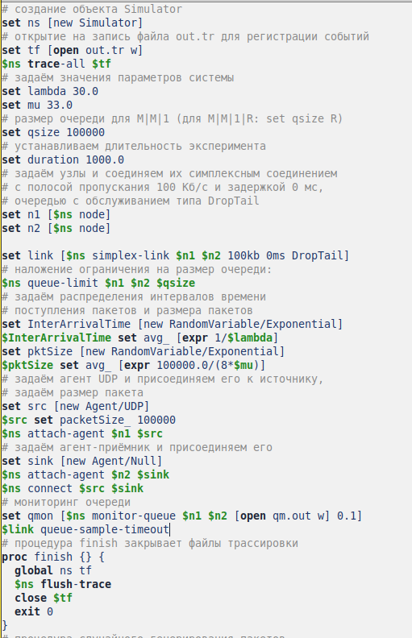
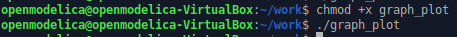
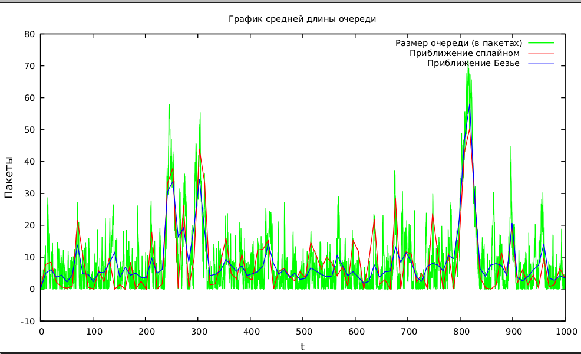

---
## Front matter
title: "Лабораторная работа №3"
subtitle: "Моделирование стохастических процессов"
author: "Эспиноса Василита Кристина Микаела"

## Generic otions
lang: ru-RU
toc-title: "Содержание"

## Bibliography
bibliography: bib/cite.bib
csl: pandoc/csl/gost-r-7-0-5-2008-numeric.csl

## Pdf output format
toc: true # Table of contents
toc-depth: 2
lof: true # List of figures
lot: true # List of tables
fontsize: 12pt
linestretch: 1.5
papersize: a4
documentclass: scrreprt
## I18n polyglossia
polyglossia-lang:
  name: russian
  options:
	- spelling=modern
	- babelshorthands=true
polyglossia-otherlangs:
  name: english
## I18n babel
babel-lang: russian
babel-otherlangs: english
## Fonts
mainfont: IBM Plex Serif
romanfont: IBM Plex Serif
sansfont: IBM Plex Sans
monofont: IBM Plex Mono
mathfont: STIX Two Math
mainfontoptions: Ligatures=Common,Ligatures=TeX,Scale=0.94
romanfontoptions: Ligatures=Common,Ligatures=TeX,Scale=0.94
sansfontoptions: Ligatures=Common,Ligatures=TeX,Scale=MatchLowercase,Scale=0.94
monofontoptions: Scale=MatchLowercase,Scale=0.94,FakeStretch=0.9
mathfontoptions:
## Biblatex
biblatex: true
biblio-style: "gost-numeric"
biblatexoptions:
  - parentracker=true
  - backend=biber
  - hyperref=auto
  - language=auto
  - autolang=other*
  - citestyle=gost-numeric
## Pandoc-crossref LaTeX customization
figureTitle: "Рис."
tableTitle: "Таблица"
listingTitle: "Листинг"
lofTitle: "Список иллюстраций"
lotTitle: "Список таблиц"
lolTitle: "Листинги"
## Misc options
indent: true
header-includes:
  - \usepackage{indentfirst}
  - \usepackage{float} # keep figures where there are in the text
  - \floatplacement{figure}{H} # keep figures where there are in the text
---

# Цель работы

Провести моделирование системы массового обслуживания (СМО).

# Задание

- Реализовать модель M|M|1; 
- Посчитать загрузку системы и вероятность потери пакетов;
- Построить график изменения размера очереди.

# Выполнение лабораторной работы

M|M|1 — однолинейная СМО с накопителем бесконечной ёмкости. Поступающий поток заявок — пуассоновский с интенсивностью \( \lambda \). Времена обслуживания
заявок — независимые в совокупности случайные величины, распределённые по экспоненциальному закону с параметром \( \mu \).

Перейдём к реализации системы. Зададим параметры: \( \lambda = 30 \), \( \mu = 33 \), размер очереди — 100000, длительность моделирования — 100000.
Определим узлы сети и соединим их симплексным каналом с пропускной способностью 100 Кб/с, задержкой 0 мс и очередью типа DropTail, установив ограничение на её размер. В качестве источника трафика выберем UDP-агент, 
приёмником будет Null-агент. Также настроим мониторинг очереди. Процедура finish будет отвечать за закрытие файлов трассировки, а процедура sendpack — за генерацию пакетов по экспоненциальному распределению. 
В данном сценарии дополнительно рассчитываются коэффициент загрузки системы и вероятность потери пакетов.

Разработаем сценирий, реализующий модель согласно описанию в Xgraph график изменения TCP-окна, график изменения длины очереди и средней длины очереди.

{#fig:001 width=70%}

{#fig:002 width=70%}

Запустив эту программу, получим значения загрузки системы и вероятности потери пакетов (рис. [-@fig:003]).

{#fig:003 width=70%}

В каталоге проекта создадим отдельный файл, например `graph_plot`, с помощью команды `touch graph_plot`. Затем откроем его для редактирования и добавим код, следуя синтаксису GNUplot (см. рисунок [-@fig:004]).

{#fig:004 width=70%}

Сделаем файл исполняемым. После компиляции проекта запустим скрипт из файла `graph_plot` (см. рисунок [-@fig:005]), который создаст изображение `qm.png` с результатами моделирования (см. рисунок [-@fig:006]).

{#fig:005 width=70%}

{#fig:006 width=70%}

# Выводы

В процессе выполнения данной лабораторной работы я провела моделирование системы массового обслуживания (СМО).

# Список литературы{.unnumbered}

::: {#refs}
:::
