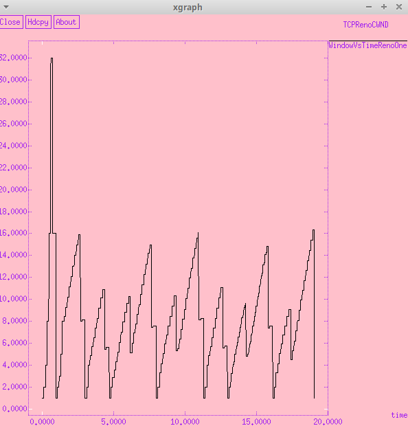
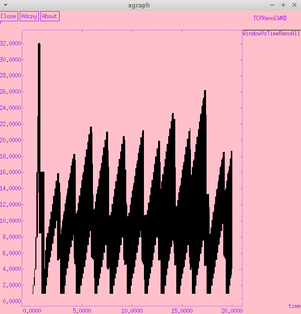
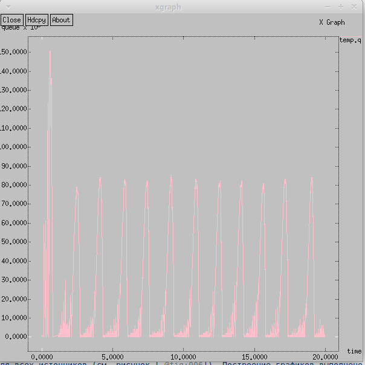
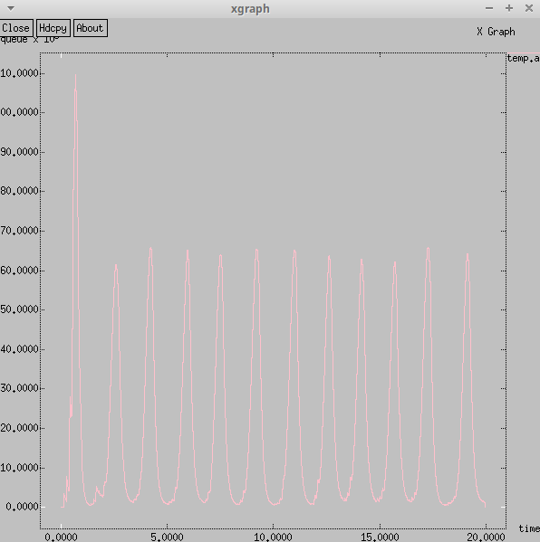
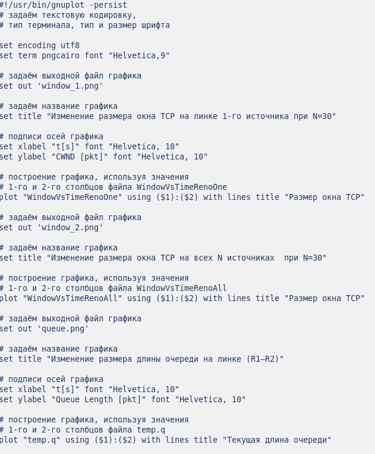
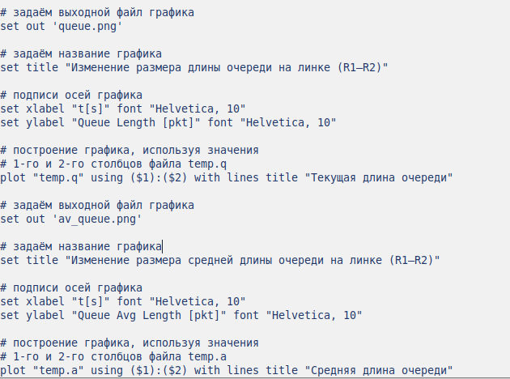
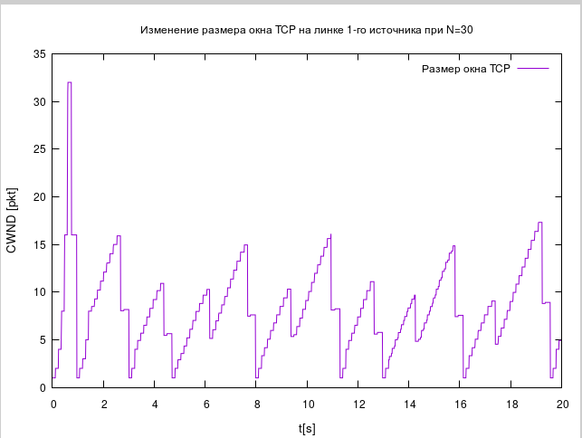
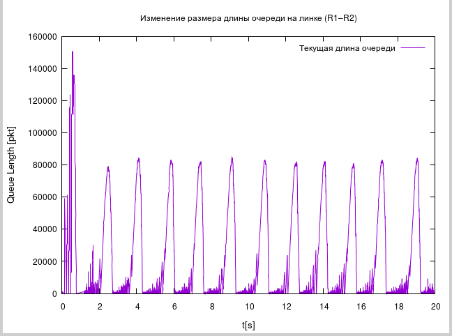

---
## Front matter
lang: ru-RU
title: "Лабораторная работа №4"
subtitle: оделирование стохастических процессов 
author:
  - Эспиноса Василита К.М.
institute:
  - Российский университет дружбы народов, Москва, Россия

date: 12/04/2025

## i18n babel
babel-lang: russian
babel-otherlangs: english

## Formatting pdf
toc: false
toc-title: Содержание
slide_level: 2
aspectratio: 169
section-titles: true
theme: metropolis
header-includes:
 - \metroset{progressbar=frametitle,sectionpage=progressbar,numbering=fraction}
---

# Информация

## Докладчик

:::::::::::::: {.columns align=center}
::: {.column width="70%"}

  * Эспиноса Василита Кристина Микаела
  * студентка
  * Российский университет дружбы народов
  * [1032224624@pfur.ru](mailto:1032224624@pfur.ru)
  * <https://github.com/crisespinosa/>

:::
::: {.column width="30%"}

:::
::::::::::::::

# Цель работы

Выполнить задание для самостоятельного выполнения.

# Задание

- Для приведённой схемы разработать имитационную модель в пакете NS-2;
- Построить график изменения размера окна TCP (в Xgraph и в GNUPlot);
- Построить график изменения длины очереди и средней длины очереди на первом маршрутизаторе;
- Оформить отчёт о выполненной работе.

# Выполнение лабораторной работы

Описание моделируемой сети:

- сеть состоит из N TCP-источников, N TCP-приёмников, двух маршрутизаторов R1 и R2 между источниками и приёмниками (N — не менее 20);
- между TCP-источниками и первым маршрутизатором установлены дуплексные
соединения с пропускной способностью 100 Мбит/с и задержкой 20 мс очередью
типа DropTail;
- между TCP-приёмниками и вторым маршрутизатором установлены дуплексные соединения с пропускной способностью 100 Мбит/с и задержкой 20 мс очередью типа DropTail;
- между маршрутизаторами установлено симплексное соединение (R1–R2) с про-пускной способностью 20 Мбит/с и задержкой 15 мс очередью типа RED,
размером буфера 300 пакетов; в обратную сторону — симплексное соедине-
ние (R2–R1) с пропускной способностью 15 Мбит/с и задержкой 20 мс очередью
типа DropTail;
- данные передаются по протоколу FTP поверх TCPReno;
- параметры алгоритма RED: qmin = 75, qmax = 150, qw = 0; 002, pmax = 0:1;
- максимальный размер TCP-окна 32; размер передаваемого пакета 500 байт; время моделирования — не менее 20 единиц модельного времени

# Выполнение лабораторной работы

{#fig:001 width=70%}

# Выполнение лабораторной работы

{#fig:002 width=70%}

# Выполнение лабораторной работы

{#fig:003 width=70%}

# Выполнение лабораторной работы
После запуска созданной программы будет сгенерирован NAM-файл с отображением схемы моделируемой сети (см. рисунок [-@fig:004]).

{#fig:004 width=70%}

# Выполнение лабораторной работы

{#fig:005 width=70%}

# Выполнение лабораторной работы

{#fig:006 width=70%}

# Выполнение лабораторной работы

{#fig:007 width=70%}

# Выполнение лабораторной работы

{#fig:008 width=70%}

# Выполнение лабораторной работы

Напишем программу для построения графиков в GNUPlot:

{#fig:009 width=70%}

# Выполнение лабораторной работы

{#fig:010 width=70%}

# Выполнение лабораторной работы

Сделаем исполняемым и запустим его. Получим 4 графика.

{#fig:011 width=70%}

# Выполнение лабораторной работы

{#fig:012 width=70%}

# Выполнение лабораторной работы

{#fig:013 width=70%}

# Выполнение лабораторной работы

{#fig:0014 width=70%} 

# Выводы

В результате выполнения данной лабораторной работы была разработана имитационная модель в пакете NS-2, построены графики изменения размера окна TCP, изменения длины очереди и средней длины очереди.