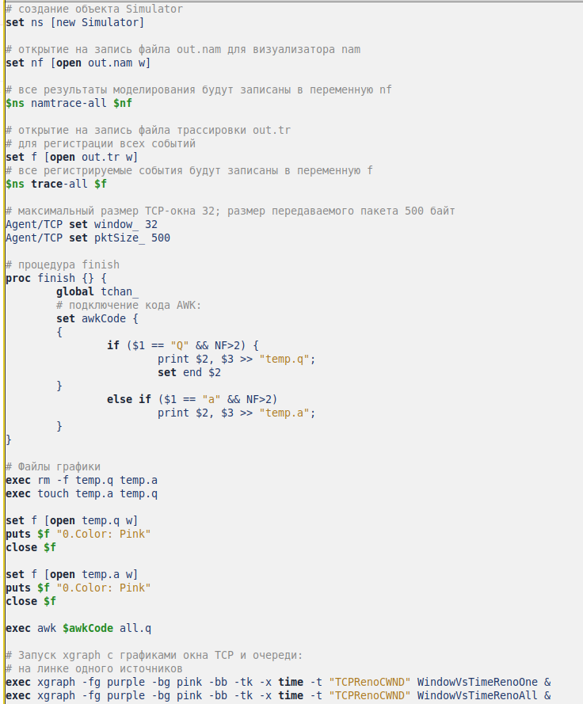
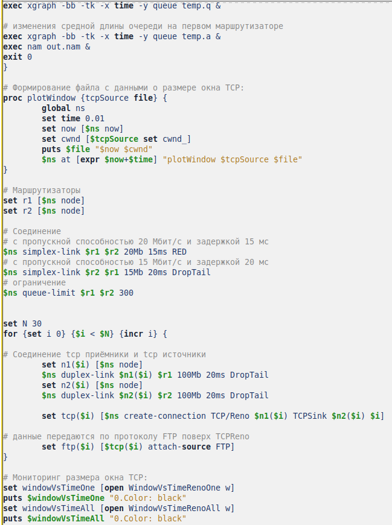
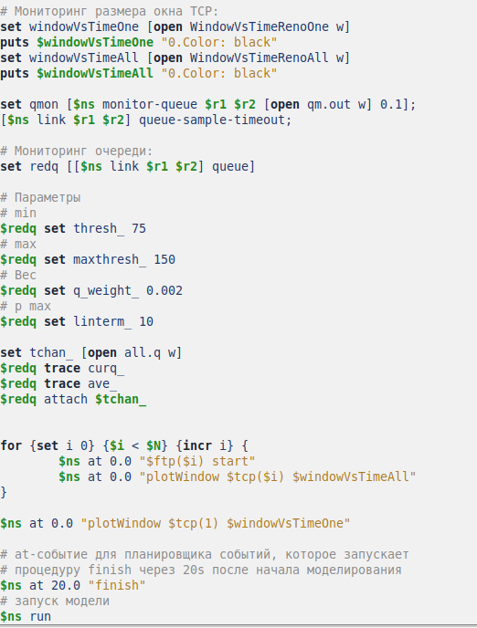
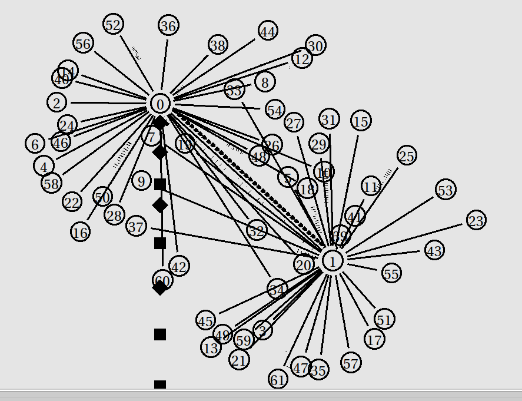
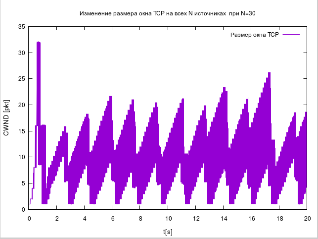
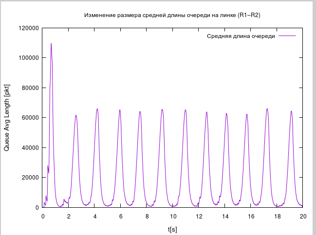

---
## Front matter
title: "Лабораторная работа №4"
subtitle: "Задание для самостоятельного выполнения"
author: "Эспиноса Василита Кристина Микаела"

## Generic otions
lang: ru-RU
toc-title: "Содержание"

## Bibliography
bibliography: bib/cite.bib
csl: pandoc/csl/gost-r-7-0-5-2008-numeric.csl

## Pdf output format
toc: true # Table of contents
toc-depth: 2
lof: true # List of figures
lot: true # List of tables
fontsize: 12pt
linestretch: 1.5
papersize: a4
documentclass: scrreprt
## I18n polyglossia
polyglossia-lang:
  name: russian
  options:
	- spelling=modern
	- babelshorthands=true
polyglossia-otherlangs:
  name: english
## I18n babel
babel-lang: russian
babel-otherlangs: english
## Fonts
mainfont: IBM Plex Serif
romanfont: IBM Plex Serif
sansfont: IBM Plex Sans
monofont: IBM Plex Mono
mathfont: STIX Two Math
mainfontoptions: Ligatures=Common,Ligatures=TeX,Scale=0.94
romanfontoptions: Ligatures=Common,Ligatures=TeX,Scale=0.94
sansfontoptions: Ligatures=Common,Ligatures=TeX,Scale=MatchLowercase,Scale=0.94
monofontoptions: Scale=MatchLowercase,Scale=0.94,FakeStretch=0.9
mathfontoptions:
## Biblatex
biblatex: true
biblio-style: "gost-numeric"
biblatexoptions:
  - parentracker=true
  - backend=biber
  - hyperref=auto
  - language=auto
  - autolang=other*
  - citestyle=gost-numeric
## Pandoc-crossref LaTeX customization
figureTitle: "Рис."
tableTitle: "Таблица"
listingTitle: "Листинг"
lofTitle: "Список иллюстраций"
lotTitle: "Список таблиц"
lolTitle: "Листинги"
## Misc options
indent: true
header-includes:
  - \usepackage{indentfirst}
  - \usepackage{float} # keep figures where there are in the text
  - \floatplacement{figure}{H} # keep figures where there are in the text
---

# Цель работы

Выполнить задание для самостоятельного выполнения.

# Задание

- Для приведённой схемы разработать имитационную модель в пакете NS-2;
- Построить график изменения размера окна TCP (в Xgraph и в GNUPlot);
- Построить график изменения длины очереди и средней длины очереди на первом маршрутизаторе;
- Оформить отчёт о выполненной работе.

# Выполнение лабораторной работы

Описание моделируемой сети:

- сеть состоит из N TCP-источников, N TCP-приёмников, двух маршрутизаторов R1 и R2 между источниками и приёмниками (N — не менее 20);
- между TCP-источниками и первым маршрутизатором установлены дуплексные
соединения с пропускной способностью 100 Мбит/с и задержкой 20 мс очередью
типа DropTail;
- между TCP-приёмниками и вторым маршрутизатором установлены дуплексные соединения с пропускной способностью 100 Мбит/с и задержкой 20 мс очередью типа DropTail;
- между маршрутизаторами установлено симплексное соединение (R1–R2) с про-пускной способностью 20 Мбит/с и задержкой 15 мс очередью типа RED,
размером буфера 300 пакетов; в обратную сторону — симплексное соедине-
ние (R2–R1) с пропускной способностью 15 Мбит/с и задержкой 20 мс очередью
типа DropTail;
- данные передаются по протоколу FTP поверх TCPReno;
- параметры алгоритма RED: qmin = 75, qmax = 150, qw = 0; 002, pmax = 0:1;
- максимальный размер TCP-окна 32; размер передаваемого пакета 500 байт; время моделирования — не менее 20 единиц модельного времени

В файле .tcl строится сеть с 30 TCP-источниками и 30 TCP-приёмниками, соединёнными через два маршрутизатора r1 и r2. 
Между источниками и r1, а также между приёмниками и r2 устанавливаются дуплексные соединения (100 Мбит/с, 20 мс, DropTail).
Между маршрутизаторами — симплексное соединение: от r1 к r2 — 20 Мбит/с, 15 мс, RED (буфер 300 пакетов); от r2 к r1 — 15 Мбит/с, 20 мс, DropTail. 
Передача данных осуществляется по FTP через TCP Reno. Настраиваются параметры RED: qmin = 75, qmax = 150, qw = 0.002, pmax = 0.1. Выполняется мониторинг окна TCP и очереди.

{#fig:001 width=70%}

{#fig:002 width=70%}

{#fig:003 width=70%}

После запуска созданной программы будет сгенерирован NAM-файл с отображением схемы моделируемой сети (см. рисунок [-@fig:004]).

{#fig:004 width=70%}

Также будут построены графики изменения размера окна TCP для соединения от первого источника (см. рисунок [-@fig:005]) и для всех источников (см. рисунок [-@fig:006]). Построение графиков выполнено с помощью xgraph.
изменения размера длины очереди (рис. [-@fig:007]) и размера средней длины очереди (рис. [-@fig:008]).

{#fig:005 width=70%}

{#fig:006 width=70%}

{#fig:007 width=70%}

{#fig:008 width=70%}

Напишем программу для построения графиков в GNUPlot:

{#fig:009 width=70%}

{#fig:010 width=70%}

Сделаем исполняемым и запустим его. Получим 4 графика.

{#fig:011 width=70%}

{#fig:012 width=70%}

{#fig:013 width=70%}

{#fig:0014 width=70%} 

# Выводы

В результате выполнения данной лабораторной работы была разработана имитационная модель в пакете NS-2, построены графики изменения размера окна TCP, изменения длины очереди и средней длины очереди.

# Список литературы{.unnumbered}

::: {#refs}
:::
