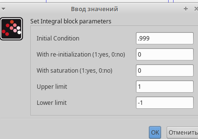

---
## Front matter
lang: ru-RU
title: "Лабораторная работа №5"
subtitle: Модель эпидемии (SIR)
author:
  - Эспиноса Василита К.М.
institute:
  - Российский университет дружбы народов, Москва, Россия
  - Объединённый институт ядерных исследований, Дубна, Россия
date: 08/03/2025

## i18n babel
babel-lang: russian
babel-otherlangs: english

## Formatting pdf
toc: false
toc-title: Содержание
slide_level: 2
aspectratio: 169
section-titles: true
theme: metropolis
header-includes:
 - \metroset{progressbar=frametitle,sectionpage=progressbar,numbering=fraction}
---

# Информация

## Докладчик

:::::::::::::: {.columns align=center}
::: {.column width="70%"}

  * Эспиноса Василита Кристина Микаела
  * студентка
  * Российский университет дружбы народов
  * [1032224624@pfur.ru](mailto:1032224624@pfur.ru)
  * <https://github.com/crisespinosa/>

:::
::: {.column width="30%"}

:::
::::::::::::::

# Цель работы

Построить модель SIR в xcos и OpenModelica.

# Задание

- Реализовать модель SIR в в xcos;
- Реализовать модель SIR с помощью блока Modelica в в xcos;
- Реализовать модель SIR в OpenModelica;
- Реализовать модель SIR с учётом процесса рождения / гибели особей в xcos (в том числе и с использованием блока Modelica), а также в OpenModelica;
- Построить графики эпидемического порога при различных значениях параметров модели (в частности изменяя параметр μ);
-Сделать анализ полученных графиков в зависимости от выбранных значений параметров модели.

# Выполнение лабораторной работы
Задача о распространении эпидемии описывается системой дифференциальных уравнений:

$$
\begin{aligned}
\dot{s} &= -\beta s(t) i(t) \\
\dot{i} &= \beta s(t) i(t) - \nu i(t) \\
\dot{r} &= \nu i(t)
\end{aligned}
$$

где β -- скорость заражения, ν-- скорость выздоровления.

# Реализация модели в xcos

Зафиксируем начальные данные: β = 1, ν= 0.3, s(0)=0.999, i(0)=0.001, r(0)=0

В меню Моделирование, Установить контекст зададим значения переменных β и ν

{#fig:001 width=70%}

# Реализация модели в xcos

Для реализации модели будем использовать следующие блоки:

- CLOCK_c -- запуск часов модельного времени;
- CSCOPE -- регистрирующее устройство для построения графика;
- TEXT_f -- задаёт текст примечаний;
- MUX -- мультиплексер, позволяющий в данном случае вывести на графике сразу несколько кривых;
- INTEGRAL_m -- блок интегрирования;
- GAINBLK_f -- в данном случае позволяет задать значения коэффициентов β и ν;
- SUMMATION -- блок суммирования;
- PROD_f -- поэлементное произведение двух векторов на входе блока.

# Реализация модели в xcos

{#fig:001 width=70%}

# Реализация модели в xcos

В параметрах верхнего и среднего блока интегрирования необходимо задать начальные значения:

{#fig:001 width=70%}

# Реализация модели в xcos

{#fig:001 width=70%}

# Реализация модели в xcos

В меню Моделирование, Установка зададим конечное время интегрирования, равным времени моделирования, в данном случае 30

{#fig:001 width=70%}

# Реализация модели в xcos

Результат моделирования представлен на рисунке

{#fig:001 width=70%}

# Реализовать модель SIR с помощью блока Modelica в в xcos

Готовая модель SIR представлена на рис
Для реализации модели (5.1) с помощью языка Modelica помимо блоков CLOCK_c,
CSCOPE, TEXT_f и MUX требуются блоки CONST_m — задаёт константу; MBLOCK
(Modelica generic) — блок реализации кода на языке Modelica. Задаём значения
переменных  β и ν

# Реализовать модель SIR с помощью блока Modelica в в xcos

{#fig:001 width=70%}

# Реализовать модель SIR с помощью блока Modelica в в xcos
Параметры блока Modelica:

# Реализовать модель SIR с помощью блока Modelica в в xcos
{#fig:001 width=70%}

# Реализовать модель SIR с помощью блока Modelica в в xcos
{#fig:001 width=70%}

# Упражнение

В качестве упражнения нам надо построить модель SIR на OpenModelica. 

{#fig:001 width=70%}

# Упражнение

 задав конечное время 30 с, В результате получаем следующий график 

{#fig:001 width=70%}

# Задание для самостоятельного выполнения

Предположим, что в модели SIR учитываются демографические процессы, в частности, что смертность в популяции полностью уравновешивает рождаемость, а все рожденные индивидуумы появляются на свет абсолютно здоровыми. Тогда получим следующую систему уравнений:

$$
\begin{aligned}
\dot{s} &= -\beta s(t) i(t) + \mu (N - s(t)) \\
\dot{i} &= \beta s(t) i(t) - \nu i(t) - \mu i(t) \\
\dot{r} &= \nu i(t) - \mu r(t)
\end{aligned}
$$

где μ — константа, которая равна коэффициенту смертности и рождаемости.

# Задание для самостоятельного выполнения

Pеализуем модель SIR с учетом демографических процессов в xcos с помощью блоков Modelica

{#fig:001 width=70%}

# Задание для самостоятельного выполнения

В результате получаем следующий график

{#fig:001 width=70%}

# Задание для самостоятельного выполнения

Реализуем модель SIR с учетом демографических процессов на OpenModelica.

{#fig:001 width=70%}

{#fig:001 width=70%}

# Выводы

В процессе выполнения данной лабораторной работы была построена модель SIR в xcos и OpenModelica.