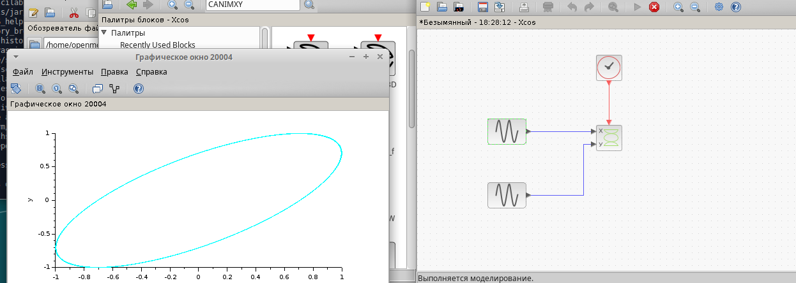

---
## Front matter
lang: ru-RU
title: Презентация по выполнению упражнения
subtitle: Фигура Лиссажу
author:
  - Эспиноса Василита К.М.
institute:
  - Российский университет дружбы народов, Москва, Россия
  - Объединённый институт ядерных исследований, Дубна, Россия
date: 01 января 1970

## i18n babel
babel-lang: russian
babel-otherlangs: english

## Formatting pdf
toc: false
toc-title: Содержание
slide_level: 2
aspectratio: 169
section-titles: true
theme: metropolis
header-includes:
 - \metroset{progressbar=frametitle,sectionpage=progressbar,numbering=fraction}
---

# Информация

## Докладчик

:::::::::::::: {.columns align=center}
::: {.column width="70%"}

  * Эспиноса Василита Кристина Микаела
  * студентка
  * Российский университет дружбы народов
  * [1032224624@pfur.ru](mailto:1032224624@pfur.ru)
  * <https://github.com/crisespinosa/>

:::
::: {.column width="30%"}

:::
::::::::::::::

## Цель работы

Выполнение упражнения по ознакомлению с программой xcos.

## Задание

Построим с помощью xcos фигуру Лиссажу со следующими параметрами:

1) A = B = 1, a = 2, b = 2, δ = 0; π/4; π/2; 3π/4; π;
2) A = B = 1, a = 2, b = 4, δ = 0; π/4; π/2; 3π/4; π;
3) A = B = 1, a = 2, b = 6, δ = 0; π/4; π/2; 3π/4; π;
4) A = B = 1, a = 2, b = 3, δ = 0; π/4; π/2; 3π/4; π.

# Выполнение лабораторной работы

## Фигура Лассажу

Математическое выражение для кривой Лиссажу $$ \begin{cases} x(t) = A sin(at + \delta),\ y(t) = B sin(bt), \end{cases} $$ где A, B — амплитуды колебаний, a, b — частоты, δ — сдвиг фаз.

## Блоки в xcos

– CLOCK_c — запуск часов модельного времени;
– GENSIN_f — блок генератора синусоидального сигнала;
– CANIMXY — анимированное регистрирующее устройство для построения графика
– TEXT_f — задаёт текст примечаний

# Выполнение лабораторной работы

{#fig:001 width=70%}

# Выполнение лабораторной работы

{#fig:002 width=70%}

# Выполнение лабораторной работы

{#fig:002 width=70%}

# Выполнение лабораторной работы

{#fig:002 width=70%}

# Выполнение лабораторной работы

{#fig:002 width=70%}

# Выполнение лабораторной работы

{#fig:002 width=70%}

# Выполнение лабораторной работы

{#fig:002 width=70%}

# Выполнение лабораторной работы

{#fig:002 width=70%}

# Выполнение лабораторной работы

{#fig:002 width=70%}

# Выполнение лабораторной работы

{#fig:002 width=70%}

# Выполнение лабораторной работы

{#fig:002 width=70%}

# Выполнение лабораторной работы

{#fig:002 width=70%}

# Выполнение лабораторной работы

{#fig:002 width=70%}

# Выполнение лабораторной работы

{#fig:002 width=70%}

# Выполнение лабораторной работы

{#fig:002 width=70%}

# Выполнение лабораторной работы

{#fig:002 width=70%}

# Выполнение лабораторной работы

{#fig:002 width=70%}

# Выполнение лабораторной работы

{#fig:002 width=70%}

# Выполнение лабораторной работы

{#fig:002 width=70%}

# Выполнение лабораторной работы

{#fig:002 width=70%}

# Выполнение лабораторной работы

{#fig:002 width=70%}

# Выводы

В процессе выполнения данной лабораторной работы я  я выполнила упражнение по ознакомлению с программой xcos.