---
## Front matter
title: "Компонентное моделирование. Scilab, подсистема xcos"
subtitle: "Упражнение по ознакомлению с программой xcos." 
author: "Эспиноса Василита Кристина Микаела"

## Generic otions
lang: ru-RU
toc-title: "Содержание"

## Bibliography
bibliography: bib/cite.bib
csl: pandoc/csl/gost-r-7-0-5-2008-numeric.csl

## Pdf output format
toc: true # Table of contents
toc-depth: 2
lof: true # List of figures
lot: true # List of tables
fontsize: 12pt
linestretch: 1.5
papersize: a4
documentclass: scrreprt
## I18n polyglossia
polyglossia-lang:
  name: russian
  options:
	- spelling=modern
	- babelshorthands=true
polyglossia-otherlangs:
  name: english
## I18n babel
babel-lang: russian
babel-otherlangs: english
## Fonts
mainfont: IBM Plex Serif
romanfont: IBM Plex Serif
sansfont: IBM Plex Sans
monofont: IBM Plex Mono
mathfont: STIX Two Math
mainfontoptions: Ligatures=Common,Ligatures=TeX,Scale=0.94
romanfontoptions: Ligatures=Common,Ligatures=TeX,Scale=0.94
sansfontoptions: Ligatures=Common,Ligatures=TeX,Scale=MatchLowercase,Scale=0.94
monofontoptions: Scale=MatchLowercase,Scale=0.94,FakeStretch=0.9
mathfontoptions:
## Biblatex
biblatex: true
biblio-style: "gost-numeric"
biblatexoptions:
  - parentracker=true
  - backend=biber
  - hyperref=auto
  - language=auto
  - autolang=other*
  - citestyle=gost-numeric
## Pandoc-crossref LaTeX customization
figureTitle: "Рис."
tableTitle: "Таблица"
listingTitle: "Листинг"
lofTitle: "Список иллюстраций"
lotTitle: "Список таблиц"
lolTitle: "Листинги"
## Misc options
indent: true
header-includes:
  - \usepackage{indentfirst}
  - \usepackage{float} # keep figures where there are in the text
  - \floatplacement{figure}{H} # keep figures where there are in the text
---

# Цель работы

Выполнение упражнения по ознакомлению с программой xcos.

# Задание

Построим с помощью xcos фигуру Лиссажу со следующими параметрами:

1) A = B = 1, a = 2, b = 2, δ = 0; π/4; π/2; 3π/4; π;
2) A = B = 1, a = 2, b = 4, δ = 0; π/4; π/2; 3π/4; π;
3) A = B = 1, a = 2, b = 6, δ = 0; π/4; π/2; 3π/4; π;
4) A = B = 1, a = 2, b = 3, δ = 0; π/4; π/2; 3π/4; π.

# Выполнение лабораторной работы
Математическое выражение для кривой Лиссажу $ \begin{cases} x(t) = A sin(at + \delta),\ y(t) = B sin(bt), \end{cases} $ где A, B — амплитуды колебаний, a, b — частоты, δ — сдвиг фаз.

– CLOCK_c — запуск часов модельного времени;
– GENSIN_f — блок генератора синусоидального сигнала;
– CANIMXY — анимированное регистрирующее устройство для построения графика
– TEXT_f — задаёт текст примечаний

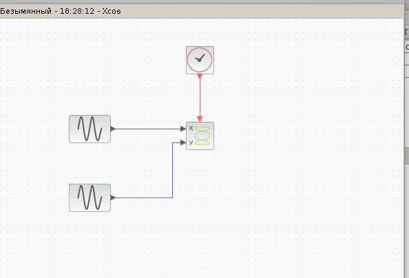{#fig:001 width=70%}

Кликнув правой кнопкой мыши по генератору синусоидальных колебаний, откройте вкладку параметров для редактирования и введите необходимые данные, и введем параметры в регистрирующее устройство. 

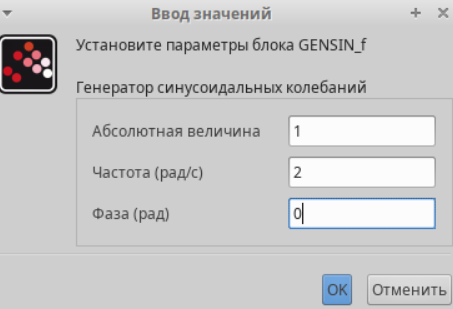{#fig:002 width=70%}

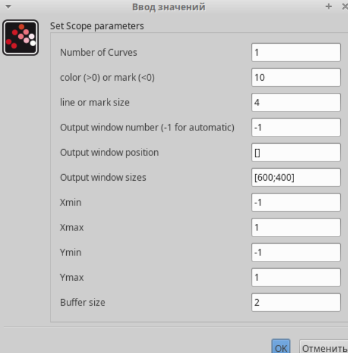{#fig:002 width=70%}

Выполним моделирование по параметрам A = B = 1, a = 2, b = 2, δ = 0, Меняющаяся фаза в первом генераторе π/4; π/2; 3π/4; π.

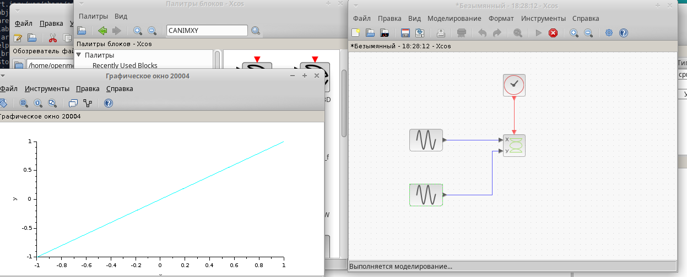{#fig:002 width=70%}

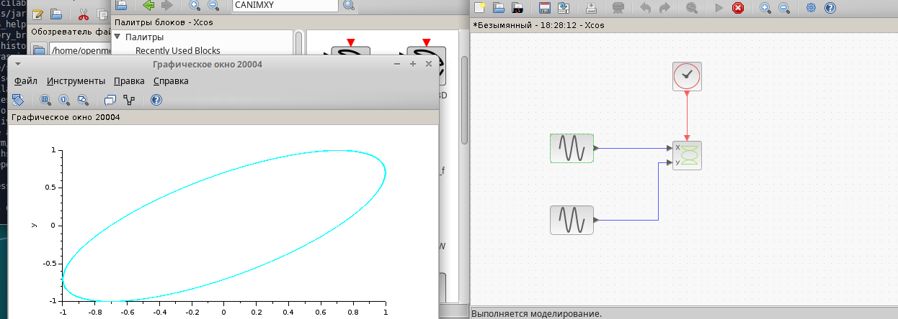{#fig:002 width=70%}

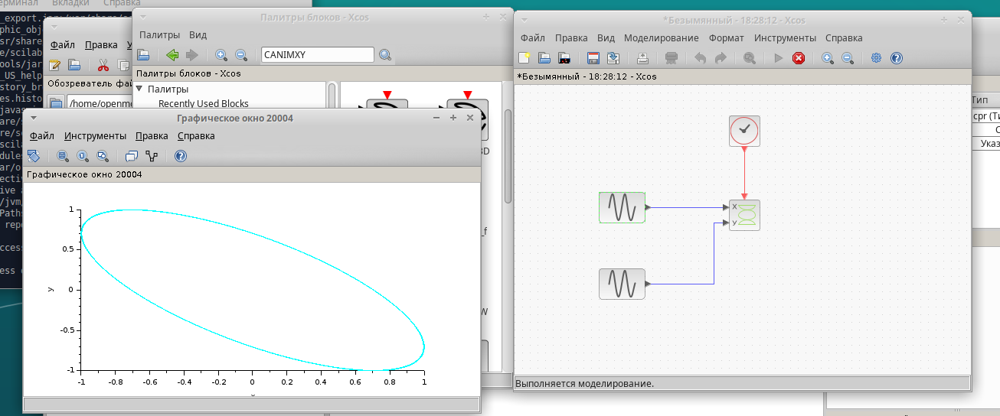{#fig:002 width=70%}

 - Меняем параметр частоты на втором генераторе: A = B = 1, a = 2, b = 4, δ = 0

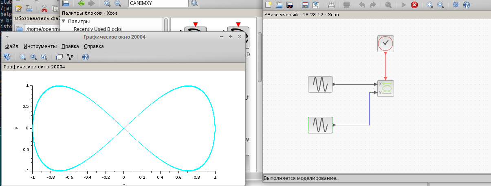{#fig:002 width=70%}

π/4; π/2; 3π/4; π;

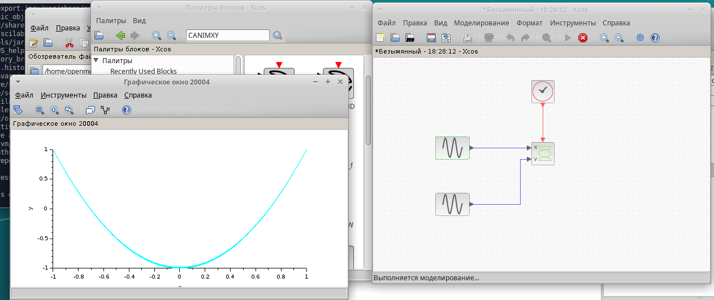{#fig:002 width=70%}

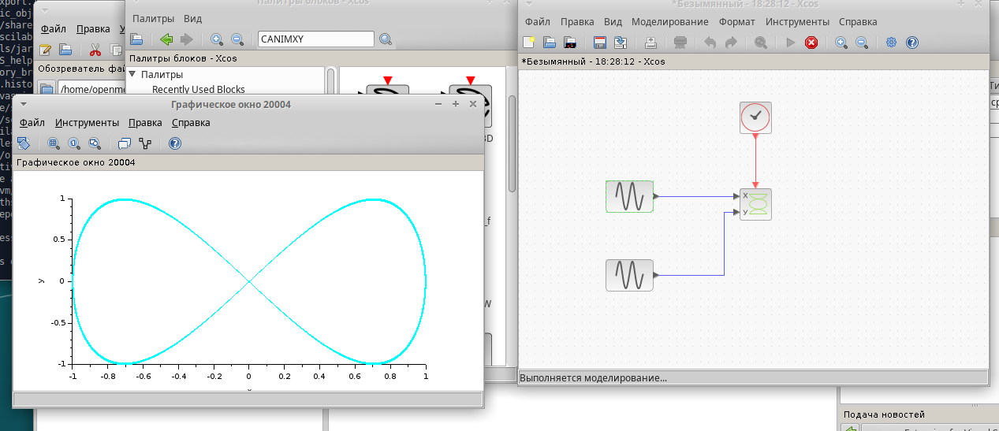{#fig:002 width=70%}

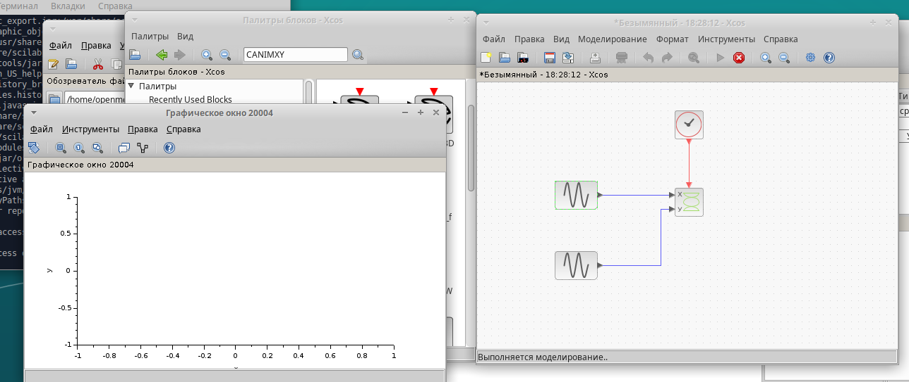{#fig:002 width=70%}

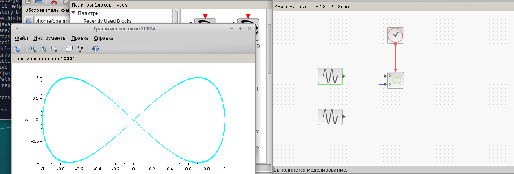{#fig:002 width=70%}

Выполним моделирование по параметрам A = B = 1, a = 2, b = 6, δ = 0, Меняющаяся фаза в первом генераторе π/4; π/2; 3π/4; π.

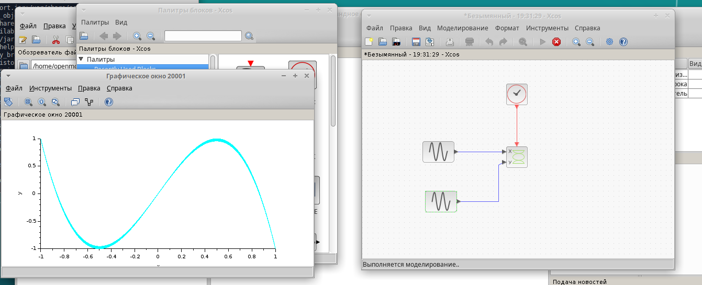{#fig:002 width=70%}

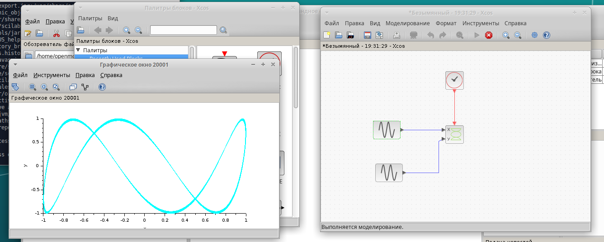{#fig:002 width=70%}

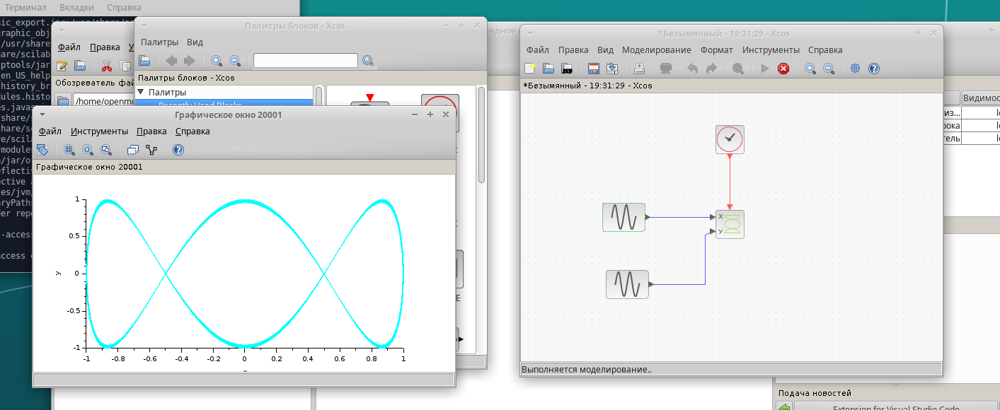{#fig:002 width=70%}

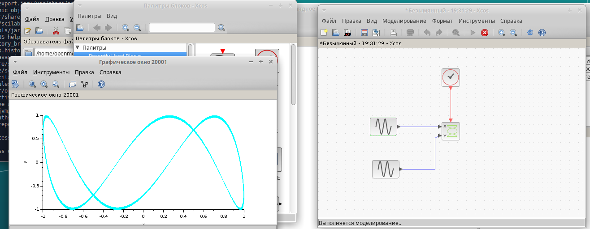{#fig:002 width=70%}

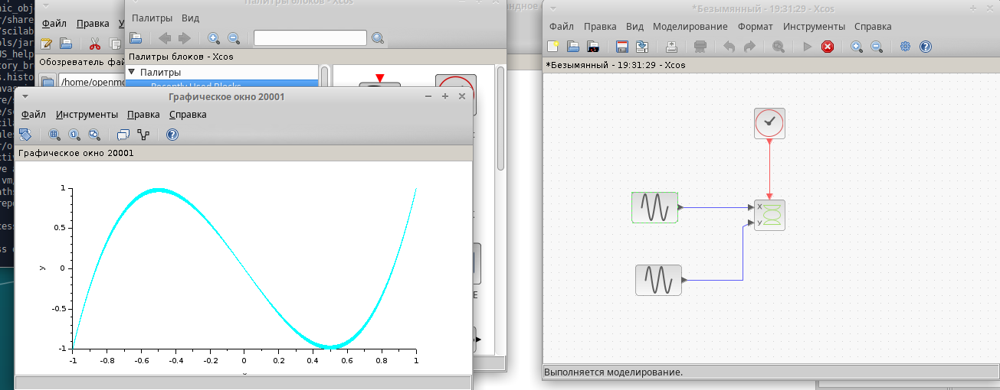{#fig:002 width=70%}

 - Меняем параметр частоты на втором генераторе: A = B = 1, a = 2, b = 3, δ = 0; Меняющаяся фаза в первом генераторе π/4; π/2; 3π/4; π.

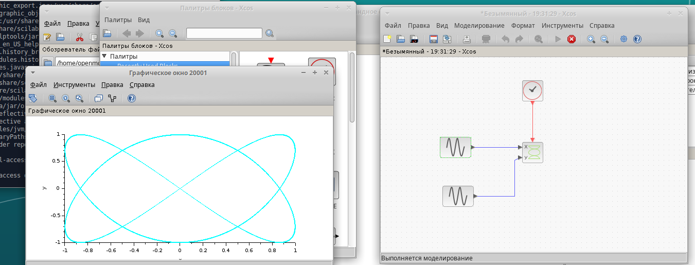{#fig:002 width=70%}

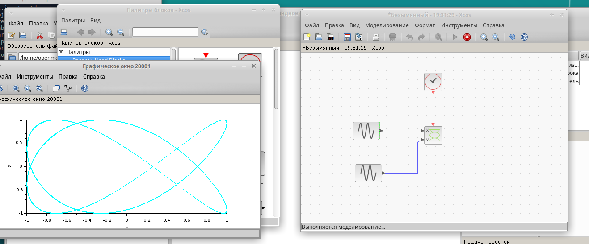{#fig:002 width=70%}

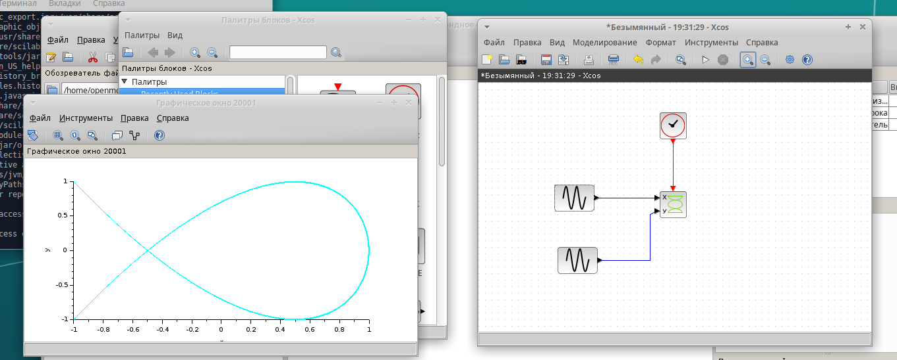{#fig:002 width=70%}

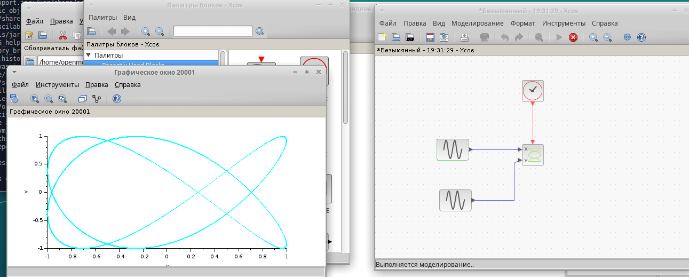{#fig:002 width=70%}

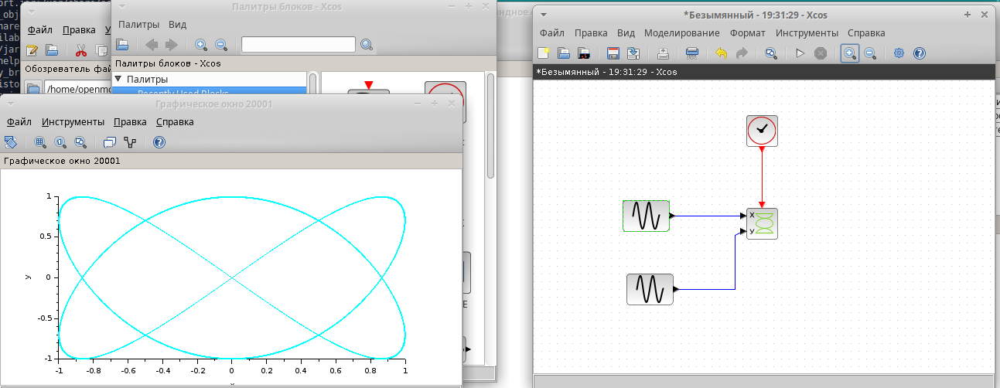{#fig:002 width=70%}

# Выводы

В процессе выполнения данной лабораторной работы я  я выполнила упражнение по ознакомлению с программой xcos.

# Список литературы{.unnumbered}

::: {#refs}
:::
